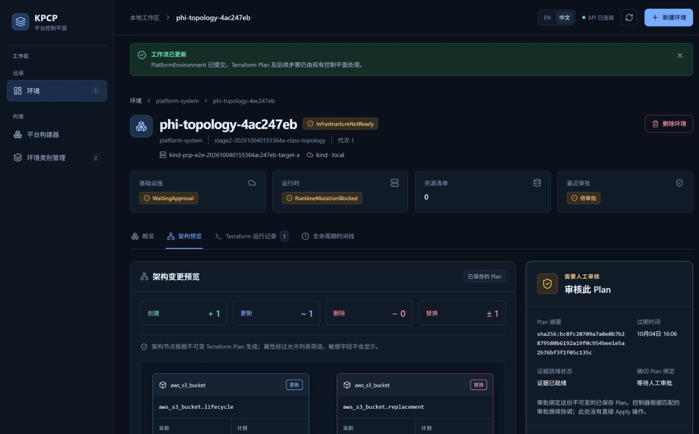

# KPCP Stage 2 验证报告

## 1. 测试结论

| 项目 | 结果 |
|---|---|
| 功能与审批流程 | PASS：历史真实网页验收 + 同产品源码本地 E2E |
| 恢复、隔离、异常场景安全保护 | PASS：2026-10-06 本地 E2E |
| 自动清理 | PASS：历史正常清理；最近 Ollama 会话清理脚本曾 FAIL，不能改记 PASS |
| 当前残留复核 | PASS：测试桶、集群、进程及临时目录均不存在；开发环境保留 |
| Ollama + phi4-mini 集成 | PASS：本次真实模型 7 个场景通过；已有真实 Kind 草稿校验记录 |
| 当前 Ollama 浏览器完整验收 | **NOT VERIFIED：缺少当前提供器的网页操作及截图** |
| QA 验证包重建 | PASS：兼容历史截图覆盖 8/9 个关键 UI 测试点，88.9% |
| Stage 2 Freeze | **BLOCKED_BY_BROWSER_TOOLING** |

用户流程是“描述需求 → 检查草稿 → 明确提交 → 审批变更 → Ready”；删除需要另一次审批。现有证据支持本地功能，当前 Ollama 网页全链路仍未验收。所有验证均在 Kind + LocalStack 范围内。

## 2. 测试环境与证据适用范围

| 项目 | 配置 |
|---|---|
| Branch / HEAD | `main` / `408163fae9f8b80192ff3a94cc584692d010f426` |
| 整理日期 | 2026-10-08（Pacific/Auckland） |
| LLM | Ollama `0.35.1` + `phi4-mini:latest`；本次真实推理退出 0 |
| Kubernetes / AWS 模拟 | Kind；外部 LocalStack Ultimate，复核时 healthy |
| API / UI | platform-api；Stage 2 Web。前端端口 5173 在运行，本轮 API 8090 未启动 |
| E2E | `e2e/Run-LocalE2E.ps1`；复用通过的 `20261006100028-5e17bd55` 全套记录 |
| 当前浏览器工具 | 插件无连接页面；Windows Computer Use 因无法可靠识别 Edge URL 停止 |
| 网页操作参数 | 见[测试设计 3.1](STAGE2_TEST_DESIGN.md#31-准备网页验收环境)，无需沿用旧截图中的类别/环境名 |

**历史验收截图，当前版本行为已由后端/E2E回归验证。** 图像拍摄于 2026-10-04，相关详情、审批、拓扑页面源码未变；2026-10-06 回归记录的 79 个产品文件与当前文件一致。会话准备脚本随后有修复，旧 E2E 记录不表示本轮重新执行了全套。

Builder 的 Provider 从 Foundry Local 改为 Ollama，因此旧草稿图仅用于 TC02“提交前无环境”，**不用于证明 TC01 的当前提供器**。本轮新截图为 0。后端全套验收记录编号为 `20261006100028-5e17bd55`；各项实际结果直接列在对应测试点中。

## 3. 执行汇总

| 用例 ID | 测试点 | 结果 | 证据 |
|---|---|---|---|
| TC01 | AI 生成环境草稿 | NOT VERIFIED（当前网页）；实际模型检查 PASS | 真实模型 7 场景通过；当前网页图缺失 |
| TC02 | Submit 前不创建资源 | PASS（模型/API + 历史网页） | 图 1；3 次真实草稿请求前后环境数均为 0 |
| TC03 | 提交环境 | PASS（历史网页 + 后端回归） | 图 2 |
| TC04 | Plan 完成并等待审批 | PASS（历史网页 + 后端回归） | 图 3 |
| TC05 | 未审批不得执行 | PASS（后端） | 10 月 6 日验收：未审批及错误审批均未执行 |
| TC06 | 多资源及三种动作拓扑 | PASS（历史真实 UI；当前组件兼容） | 图 4 |
| TC07 | 审批后执行 | PASS（历史网页 + 后端回归） | 图 5 |
| TC08 | 环境 Ready | PASS（历史网页 + 后端回归） | 图 5 |
| TC09 | 后台重启恢复 | PASS（后端） | 10 月 6 日验收：三个阶段重启后恢复，无重复执行 |
| TC10 | 多目标隔离 | PASS（后端） | 10 月 6 日验收：两个目标无交叉资源 |
| TC11 | 异常场景安全保护 | PASS（后端） | 10 月 6 日验收：错误请求安全拒绝 |
| TC12 | 请求删除环境 | PASS（历史网页 + 后端回归） | 图 6；删除中状态记录 |
| TC13 | Destroy 独立审批 | PASS（历史网页 + 后端回归） | 图 6 |
| TC14 | Destroy 完成、环境消失 | PASS（历史网页 + 后端回归） | 图 7 |
| TC15 | Cleanup 无残留 | PASS（历史正常清理 + 当前只读复核） | 本次复核无残留；最近会话自动清理完成状态仍未验证 |

14 项有适用范围内的通过证据，1 项当前 UI 未验证。**历史网页 PASS 不表示当前 Ollama 完整浏览器流程 PASS。**

## TC01 AI 生成环境草稿

**测试目的**：用户通过自然语言获得有效环境草稿。

**前置条件**：Ollama / phi4-mini、API、Ready 类别可用。

**测试步骤**

1. 按测试设计填表并生成草稿。
2. 核对 Ollama、模型配置和草稿字段。

**预期结果**：草稿 Validated；无阻塞错误；明确参数正确。

**实际结果**：本次实际模型 7 个检查通过，耗时 39.37 秒；使用测试 Kubernetes client。本轮没有浏览器点击，缺少显示 Ollama 的草稿截图。

**测试结果**：`NOT VERIFIED - 缺少截图证据`（模型集成单独 PASS）。

**证据**：本次真实模型检查 7 场景通过，详见实际结果；当前网页截图缺失。不得使用图 1 的 Foundry 字段证明当前 Ollama。

## TC02 草稿生成不自动创建资源

**测试目的**：确认 AI 生成草稿后仍需用户明确提交。

**前置条件**：记录生成前环境数量。

**测试步骤**

1. 生成草稿，不点击 Submit。
2. 核对环境列表和执行记录。

**预期结果**：环境数不变；无基础设施执行。

**实际结果**：真实 Ollama → API → Kind 的 3 次草稿请求前后环境均为 0；该次仅测草稿、未开启基础设施执行。本次模型检查也未创建环境。历史网页显示环境数 0。

**测试结果**：`PASS`（草稿/API；历史网页补充）。

**证据**

图 1：TC02 已生成草稿但环境数量为 0，重点查看左侧计数。历史截图中的 Provider 是 Foundry Local，只验证提交前状态；当前 Ollama 的 3 次真实草稿请求前后环境数均为 0。

## TC03 提交环境

**测试目的**：确认用户提交后环境创建并开始处理。

**前置条件**：草稿通过校验。

**测试步骤**

1. 审核草稿并点击 Submit。
2. 查看详情与环境数量。

**预期结果**：环境出现；状态开始推进。

**实际结果**：历史网页环境数为 1，详情显示 PlanRunning；后端回归明确提交及环境读取通过。

**测试结果**：`PASS`（历史网页 + 同产品源码回归）。

**证据**

图 2：TC03 环境已提交，重点查看成功提示、环境数 1 和 PlanRunning。历史验收截图，当前版本行为已由后端/E2E回归验证。

## TC04 Plan 生成并等待审批

**测试目的**：确认用户可审核变更，审批前不执行。

**前置条件**：环境已提交。

**测试步骤**

1. 等待计划完成。
2. 保持未审批，查看详情。

**预期结果**：显示等待审批；Apply 未开始。

**实际结果**：WaitingApproval、运行资源数 0；历史审批前 Apply 数为 0，后端回归无提前执行。

**测试结果**：`PASS`（历史网页 + 同产品源码回归）。

**证据**

图 3：TC04 计划已完成，重点查看 WaitingApproval、资源数 0 及右侧“等待人工审批”。历史验收截图，当前版本行为已由后端/E2E回归验证。

## TC05 未审批不得执行

**测试目的**：确认未经审批不能改变基础设施。

**前置条件**：方案等待审批。

**测试步骤**

1. 保持未审批，并尝试错误审批。
2. 检查执行记录与目标资源。

**预期结果**：不产生 Apply，不修改目标资源。

**实际结果**：未审批及错误审批均未触发执行；历史网页审批前 Apply 数为 0。

**测试结果**：`PASS`（后端）。

**证据**：2026-10-06 全套验收通过；图 3 显示等待审批且运行资源数为 0，历史检查确认审批前没有 Apply。

## TC06 PlanTopology 展示

**测试目的**：确认用户能看清资源变更及关系。

**前置条件**：使用测试设计 3.2 的真实多资源计划。

**测试步骤**

1. 打开架构预览，核对三种动作和连线。
2. 切换中英文及不同宽度，检查属性、重叠和敏感信息。

**预期结果**：3 节点、2 连线；CREATE / UPDATE / REPLACE 各 1；显示正常。

**实际结果**：真实计划包含三种动作各 1；8 组语言/宽度检查无重叠，连线端点误差 0；截图未见连接凭据。当前拓扑组件源码与该次相同，后端计划图回归通过。

**测试结果**：`PASS`（历史真实 UI 与兼容性核对；本轮未重新渲染网页）。

**证据**

图 4：TC06 重点查看 UPDATE 主桶、REPLACE 替换桶、CREATE 对象及两条关系线。历史验收截图，当前版本行为已由后端/E2E回归验证。

## TC07 审批后执行

**测试目的**：确认批准当前方案后开始执行。

**前置条件**：当前方案可审批。

**测试步骤**

1. 点击批准当前方案。
2. 查看审批反馈和执行结果。

**预期结果**：审批接受；Apply 开始并推进。

**实际结果**：历史网页显示审批已记录并最终 Ready；真实执行结果 Succeeded，后端审批及执行回归通过。

**测试结果**：`PASS`（历史网页 + 同产品源码回归）。

**证据**

图 5：TC07 重点查看顶部审批成功反馈和“最近审批：已记录”。该图也覆盖 TC08。历史验收截图，当前版本行为已由后端/E2E回归验证。

## TC08 环境 Ready

**测试目的**：确认执行成功且预期资源可用。

**前置条件**：已完成有效审批。

**测试步骤**

1. 等待环境 Ready。
2. 核对基础设施、运行时和预期资源。

**预期结果**：各状态 Ready，预期资源存在。

**实际结果**：环境、基础设施、运行时均 Ready；运行资源 1；新对象、更新后的桶标签和替换桶均核验通过。

**测试结果**：`PASS`（历史网页 + 同产品源码回归）。

**证据**

图 5：TC08 重点查看环境“就绪”、基础设施/运行时“就绪”和资源数 1。历史验收截图，当前版本行为已由后端/E2E回归验证。

## TC09 服务重启恢复

**测试目的**：确认后台重启后任务不重复执行。

**前置条件**：隔离的 recovery 验证环境。

**测试步骤**

1. 在处理中、计划完成后及 Ready 后分别重启后台。
2. 核对执行数量与最终状态。

**预期结果**：任务恢复，最终正确，不重复执行。

**实际结果**：三个阶段均恢复；保持 1 次计划任务、1 次 Apply，资源状态稳定。

**测试结果**：`PASS`（2026-10-06 后端回归；产品源码一致）。

**证据**：2026-10-06 全套验收中，处理中、计划完成后及 Ready 后的重启检查均通过，保持 1 次计划任务、1 次 Apply。

## TC10 多环境/目标隔离

**测试目的**：确认 A 的操作不会影响 B。

**前置条件**：两个环境使用不同 Kind 目标。

**测试步骤**

1. 分别创建和操作 A、B。
2. 检查资源位于各自目标，另一个目标无交叉资源。

**预期结果**：资源位置正确，两个环境相互隔离。

**实际结果**：A / B 分别落到 target-a / target-b，交叉检查通过。

**测试结果**：`PASS`（2026-10-06 后端回归；产品源码一致）。

**证据**：2026-10-06 全套验收中，A / B 分别位于各自目标，交叉检查均通过。

## TC11 异常场景安全保护

**测试目的**：确认错误请求或错误目标不会继续变更。

**前置条件**：准备错误审批和不匹配目标。

**测试步骤**

1. 提交错误审批或未注册目标。
2. 查看拒绝结果及目标资源。

**预期结果**：拒绝或安全停止，无错误执行。

**实际结果**：错误审批、过期审批依据、未注册目标及不完整目标信息均受保护；没有运行资源变更。

**测试结果**：`PASS`（2026-10-06 后端回归；产品源码一致）。

**证据**：2026-10-06 全套验收中，错误审批、过期审批依据、未注册目标及不完整目标信息均被拒绝或安全停止。

## TC12 删除环境

**测试目的**：确认删除请求进入清理流程。

**前置条件**：环境 Ready。

**测试步骤**

1. 点击删除，输入完整名称并请求删除。
2. 等待删除状态和销毁计划。

**预期结果**：请求接受；清理前环境仍可查看。

**实际结果**：历史网页显示“删除中”，环境仍存在，进入销毁方案等待审批。

**测试结果**：`PASS`（历史网页 + 同产品源码回归）。

**证据**

图 6：TC12 重点查看顶部“已请求删除”、环境“删除中”和左侧环境数 1。该图也覆盖 TC13。历史验收截图，当前版本行为已由后端/E2E回归验证。

## TC13 Destroy 独立审批

**测试目的**：确认创建审批不能代替删除审批。

**前置条件**：已请求删除，已有创建审批。

**测试步骤**

1. 查看新销毁方案，先不审批。
2. 单独批准该方案。

**预期结果**：旧审批不能触发销毁；新审批后才执行。

**实际结果**：历史网页已有“审批已记录”但销毁方案仍等待人工审批，DELETE 3；单独审批后销毁成功。后端删除 API 回归也覆盖独立审批。

**测试结果**：`PASS`（历史网页 + 同产品源码回归）。

**证据**

图 6：TC13 重点查看右侧“审核销毁 Plan / 等待人工审批”，上方旧审批记录不能解除该等待。历史验收截图，当前版本行为已由后端/E2E回归验证。

## TC14 Destroy 完成

**测试目的**：确认删除结束后环境和资源消失。

**前置条件**：销毁方案已独立审批。

**测试步骤**

1. 等待销毁执行完成。
2. 查看列表并核对目标资源。

**预期结果**：资源移除，环境从列表消失。

**实际结果**：页面自动返回列表并提示清理完成，环境数 0；历史测试桶和目标运行资源均不存在，销毁执行退出 0。

**测试结果**：`PASS`（历史网页 + 同产品源码回归）。

**证据**

图 7：TC14 重点查看“清理完成，环境已移除”和环境总数 0。历史验收截图，当前版本行为已由后端/E2E回归验证。

## TC15 Cleanup 无残留

**测试目的**：确认测试资源不残留、既有环境保留。

**前置条件**：测试结束，保留资源归属记录。

**测试步骤**

1. 核对正常会话结束与自动清理结果。
2. 只读检查测试桶、集群、进程和临时目录。

**预期结果**：测试资源不存在，开发环境和外部服务保留。

**实际结果**：10 月 6 日全套清理 PASS；10 月 7 日正常释放准备会话也 PASS。最近 Ollama 会话超时且自动清理记录 FAIL；本次复核其两个桶均 404、集群/进程/目录均不存在，`pcp-dev` 保留、外部 LocalStack healthy。当前无残留不证明那次失败脚本完成了清理。

**测试结果**：`PASS`（历史正常清理 + 当前无残留）；最近 Ollama 会话正常结束/自动清理仍 `NOT VERIFIED`。

**证据**：10 月 6 日全套及 10 月 7 日正常释放准备会话均清理通过；本次只读复核未发现最近超时会话的残留。准备会话没有浏览器点击，不能用于证明 Ollama 网页验收。

## 4. 遗留问题

在已验证范围内，当前未发现 P0/P1/P2 产品缺陷。

| ID | 级别 | 问题 | 是否阻塞 |
|---|---|---|---|
| TOOL-01 | 工具限制 | 浏览器无连接页面；Windows Computer Use 无法可靠确认 URL，缺当前 Ollama 草稿/完整网页链路截图 | 阻塞最终 Freeze；不判产品 FAIL |
| ENV-01 | 历史环境问题 | 最近 Ollama 会话等待释放超时，清理时外部 LocalStack 容器缺失；当前资源已核验不存在 | 仍需完整网页会话正常结束证据；不改写原 FAIL |

## 5. 证据索引

| 图号 | 文件 | 对应测试点 | 说明 |
|---|---|---|---|
| 图 1 | [TC02-no-resource-before-submit.jpg](验收截图/TC02-no-resource-before-submit.jpg) | TC02 | 草稿已生成但环境数 0；Provider 为历史 Foundry |
| 图 2 | [TC03-environment-created.jpg](验收截图/TC03-environment-created.jpg) | TC03 | 明确提交后 PlanRunning |
| 图 3 | [TC04-awaiting-approval.jpg](验收截图/TC04-awaiting-approval.jpg) | TC04 | 等待审批及运行资源数 0 |
| 图 4 | [TC06-plan-topology.jpg](验收截图/TC06-plan-topology.jpg) | TC06 | 真实三动作、多资源及两条连线 |
| 图 5 | [TC08-apply-ready.jpg](验收截图/TC08-apply-ready.jpg) | TC07、TC08 | 审批已记录、环境及资源 Ready |
| 图 6 | [TC13-destroy-approval.jpg](验收截图/TC13-destroy-approval.jpg) | TC12、TC13 | 删除已请求，但新销毁方案仍需审批 |
| 图 7 | [TC14-environment-removed.jpg](验收截图/TC14-environment-removed.jpg) | TC14 | 删除后自动返回列表、环境数 0 |

`UI_CRITICAL_TESTS = 9`　｜　`UI_CRITICAL_TESTS_WITH_SCREENSHOT = 8`　｜　`SCREENSHOT_COVERAGE = 88.9%`

覆盖统计包含兼容历史截图；当前新截图覆盖为 **0/9**。唯一无适用截图的关键 UI 用例是 **TC01（Ollama 提供器草稿）**。图 5 / 图 6 分别同时证明审批反馈/Ready、删除已请求/销毁待审批，按测试点计数，没有把共享图片算成新的图片文件。

本任务开始时 `docs/` 已被前次提交清空，无现存旧报告可归档。恢复架构文档及所选真实证据，未恢复旧开发报告；权威入口为本报告、[测试设计](STAGE2_TEST_DESIGN.md)及[冻结证据](STAGE2_FREEZE_EVIDENCE.md)。
