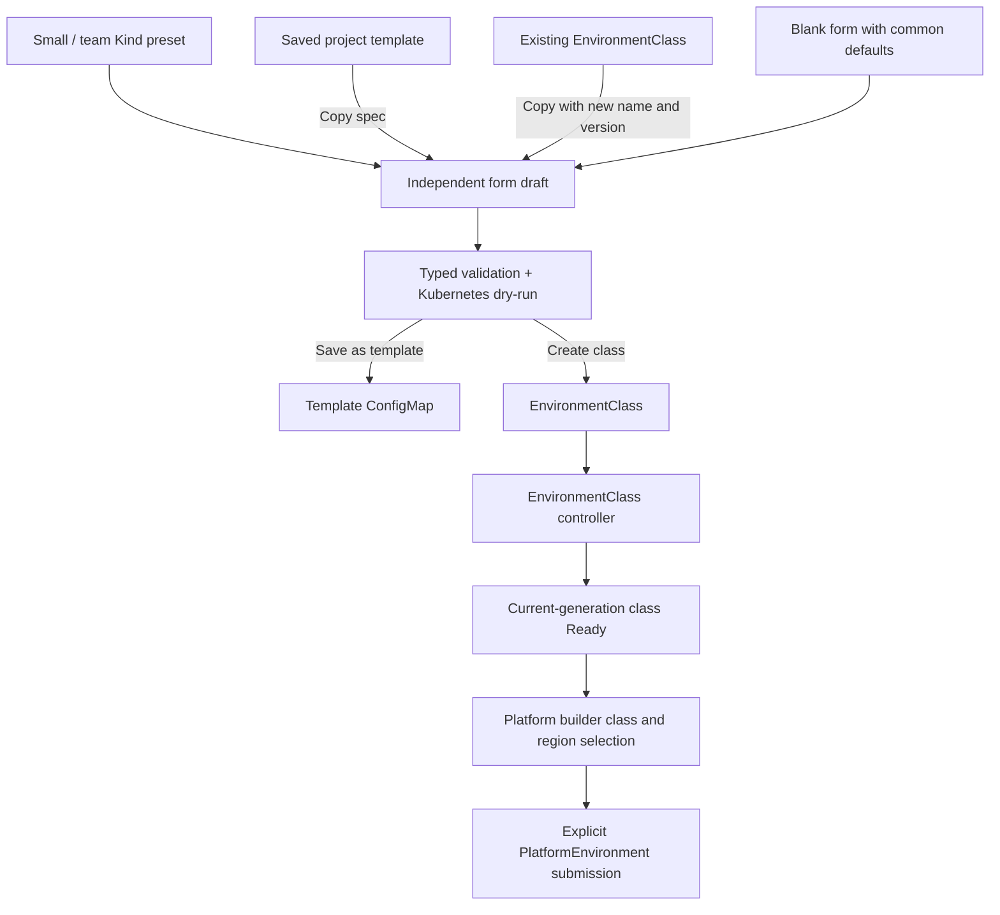

# Architecture

Updated: 2026-10-06. Reviewed against the current working-tree implementation.

This document describes the current components, persisted state, configuration
flow and execution contracts.

## Configuration flow



### Presets and saved templates

- Starter presets are frontend defaults. Small Kind uses node bounds 1–3,
  three environments, one concurrent Plan and one concurrent Apply. Team Kind
  uses 1–10, ten environments, two Plans and one Apply. Both select Manual.
- Presets leave project-specific source, target, backend and Runner connections
  for the operator to fill. Startup does not create example classes.
- A saved template is a ConfigMap named `pcp-class-template-{name}` in the
  management cluster's `default` namespace. Labels identify its configuration
  kind and `platform-api` ownership; `template.json` stores name, title,
  description and the full class spec. It is not another CRD.
- Using a template or existing class copies its spec into an independent draft.
  Source/backend sections start collapsed for configured copies. Changes do not
  update the template, source class or existing environments.
- Names are unique. There is no template update endpoint: save a revised snapshot
  under a new name. Refresh discards unsaved drafts; saved templates survive API
  restart. Deleting the Kind cluster deletes its templates.
- Template deletion requires the exact machine name and UID, with Kubernetes
  UID/resourceVersion preconditions. Existing classes remain independent.

### Class admission, readiness and deletion

The form validates typed inputs and uses Kubernetes dry-run without persisting
an EnvironmentClass. An edit invalidates the previous validation result.
Creating a class repeats typed validation and writes a cluster-scoped object;
it does not create an environment, Runner Job or runtime resource.

Class inputs include a pinned 40–64 digit source commit, repository-relative
Terraform directory, backend ConfigMap reference, matching backend/Runner
ServiceAccount, Runner image and identity, target, region limits, capacity,
execution settings and optional runtimeObjects. Inline credentials and Secret
objects are rejected; legacy sensitive values are redacted and cannot be copied.

`EnvironmentClassReconciler` records the spec digest and observed generation,
tracks PlatformEnvironment references, installs
`platform.example.io/environmentclass-finalizer`, and reports `ClassValidated`.
An externally changed admitted spec is marked not Ready with `ClassSpecChanged`.
The management API has no class update endpoint: changes require a new named
version.

Class Ready means admitted configuration and controller processing. It does not
prove that the backend exists, the source can be fetched, the Runner image can
run, or infrastructure/runtime resources are ready. Only current Ready classes
are usable in the builder. Regions come from the selected class's default region
and allowedRegions; they are not cloud discovery.

Class deletion checks the exact name, UID and current reference count. The API
rejects a referenced class; the controller also keeps its finalizer while any
environment references it. Deleting an unused class leaves referenced backend
configuration and infrastructure untouched.

## Lifecycle

~~~text
PlatformEnvironment
    ↓ selects
EnvironmentClass
    ↓ materializes
InfraStack
    ↓ creates immutable attempt
TerraformRun: Plan
    ↓ review boundary
ChangeApproval
    ↓ approves exact plan
TerraformRun: Apply
    ↓ Apply or NoChange produces trusted evidence
TargetDiscovery
    ↓ creates
ResourceSet
    ↓ server-side apply, inventory, readiness
Runtime Reconciliation
    ↓
EnvironmentReady
~~~

Each PlatformEnvironment binds to its intended runtime target through trusted
discovery. Different environments can select different clusters.

Creation starts from the user-facing PlatformEnvironment. Its EnvironmentClass
defines the approved infrastructure source, backend, execution identity, and
runtime intent. The controller materializes and reconciles an InfraStack;
Terraform is an execution engine, not the top-level control plane.

Infrastructure changes require a Plan followed by an explicit ChangeApproval.
Apply consumes the exact saved plan produced by that Plan attempt. A successful
Apply or a proven NoChange both record a last-converged source closure and
trusted target discovery. Runtime objects are not applied until the current
infrastructure and target evidence pass admission checks.

Deletion is finalizer-driven. The controller waits for active mutation to
finish, prunes ResourceSet-owned runtime objects, plans and applies Terraform
destroy from the last converged closure, records infrastructure removal, then
removes finalizers.

## Responsibilities

| Resource | Responsibility |
|---|---|
| Template ConfigMap | API-managed reusable configuration snapshot, independent of classes |
| PlatformEnvironment | User-facing desired state and lifecycle owner |
| EnvironmentClass | Typed inputs; class controller records spec identity, current Ready, usage and deletion protection |
| InfraStack | Materialized infrastructure intent and convergence state |
| TerraformRun | Immutable Plan, Apply, or Destroy execution attempt |
| ChangeApproval | Explicit approval bound to one exact Plan and its evidence |
| TargetDiscovery | Trusted identity and connection profile for the target |
| ResourceSet | Runtime objects, SSA ownership, inventory, readiness, and prune |

TerraformRun artifacts and Kubernetes status provide durable evidence for
reconciliation and recovery. Controllers derive progress from persisted
resources and artifacts rather than relying on in-memory workflow state.

Readiness is generation-aware: a condition from an older desired generation
does not make the current object Ready. Job completion alone is not environment
readiness; infrastructure evidence, trusted target identity, runtime object
readiness, and inventory must converge. ResourceSet pruning is limited to
objects recorded as owned by that ResourceSet.

Plan, Apply, and Destroy attempts are immutable records. A retry or desired
input change does not rewrite an earlier attempt or its approval; a new attempt
must be admitted against the current generation and its own evidence.

## Safety invariants

- **Exact-plan execution:** Apply and Destroy consume the saved plan artifact
  referenced by the approved execution record; they do not create a new plan
  implicitly.
- **Approval boundary:** approval is bound to the PlanRun UID, plan digest,
  execution-context digest, effective-input digest, and plan-report digest.
  Any changed input requires a new Plan and approval.
- **Mutation fence:** runtime mutation is denied while infrastructure is not
  current and ready, the target is stale or inaccessible, the environment is
  deleting, or a mutation fence is active.
- **Idempotency:** generation-aware immutable attempts, stable ownership, and
  persisted terminal evidence prevent duplicate execution and ambiguous retries.
- **Reconciliation:** current-generation conditions and observed state, not
  command submission alone, determine readiness.
- **Target isolation:** infrastructure execution identity, runtime target
  identity, and target connection profile are distinct. A client is created
  only from trusted discovery and must match the intended account and cluster.
- **Fail closed:** missing approval, invalid identity, incomplete discovery,
  stale evidence, or failed admission produces no runtime side effect.
- **Recovery:** after manager restart, persisted resources and artifacts
  reconstruct active work and converged state without corrupting approvals or
  repeating completed mutations.

## Identity and artifact boundaries

The Terraform runner uses the ServiceAccount immutably bound to its
TerraformRun. InfrastructureExecutionIdentity authorizes infrastructure
operations. RuntimeTargetIdentity and TargetConnectionProfile select and
authenticate the Kubernetes client used for runtime reconciliation. These
identities are never substituted for one another.

Source closure, variables, backend configuration, and execution identity are
captured in the effective Plan input. Content digests bind review and execution
to the same source and artifacts. TargetDiscovery is trusted input to
ResourceSet; Terraform Destroy output is not treated as new target identity.

## Stage 2 experience layer

```text
Developer / Operator
        ↓
React Console / AI Platform Builder
        ↓
platform-api (draft request)
  └── Ollama / Phi-4-mini (native POST /api/chat)
        ↓ structured JSON
platform-api (strict parse + deterministic validation)
        ↓ typed preview
Human review + explicit submit
        ↓
Kubernetes API
        ↓
PlatformEnvironment
        ↓
Existing Stage 1 Control Plane
        ↓
Terraform + Target Kubernetes
```

The React console also provides class/template management before the AI builder.
The console normally runs at `127.0.0.1:5173`, with `/api` proxied to the local
API at `127.0.0.1:8090`. EN/Chinese preference is persisted locally; language
changes retain a form draft.

Kubernetes stores desired state, conditions, execution records, approvals and
template ConfigMaps. Artifact storage holds source bundles, saved plans, backend
snapshots and reports; local validation uses LocalStack for this object storage.
The API projects resources and evidence into UI-safe views and does not run a
second workflow engine or application database.

Environment create/update/delete requests change the top-level
`PlatformEnvironment`. Class and template requests write their own Kubernetes
objects. Reconciliation, runtime cleanup and Terraform destroy remain controller
responsibilities. Approval creates the immutable `ChangeApproval` bound to the
PlanRun UID and every current plan/evidence digest. There is no Apply endpoint.
`Recorded` means an approval decision was saved, not that Apply succeeded.

### API write boundaries

| Route / action | Write or effect |
| --- | --- |
| `POST /api/drafts` | Calls the configured provider; strictly parses and validates intent; no resource creation |
| `POST /api/classes/validate` | Typed validation and Kubernetes dry-run; no persisted class |
| `POST /api/classes` | Creates an EnvironmentClass; controller supplies status |
| `DELETE /api/classes/{name}` | Requests unused class deletion after identity/usage checks |
| `POST /api/class-templates` | Creates the template ConfigMap in management `default` |
| `DELETE /api/class-templates/{name}` | Deletes only the identified template ConfigMap |
| Environment create/update/delete | Writes or requests deletion of PlatformEnvironment |
| `POST /api/terraform-runs/{namespace}/{name}/approve` | Creates ChangeApproval bound to the selected Plan and evidence |
| List/detail/plan/timeline routes | Read-only views of resources and artifacts |

The API needs class-resource and template-ConfigMap permissions in addition to
the environment and approval permissions. Human approval records a decision;
controllers determine when the matching saved plan may execute.

The optional `plan-visualization.json` is derived from `terraform show -json`
for the exact saved Plan and contains only allowlisted resource metadata.
Failure to store it does not fail the Plan. It is read-only UI evidence and is
not part of approval or Apply admission. Ollama emits a constrained
JSON intent only; the API strictly parses it and validates class, namespace,
registered target, region, Valkey settings, and capacity before showing typed
YAML. A separate human action submits the resource. The unauthenticated API
and web UI are local operator tools, not production endpoints.

The default local provider is `AI_PROVIDER=ollama`, with
`OLLAMA_ENDPOINT=http://127.0.0.1:11434` and
`OLLAMA_MODEL=phi4-mini:latest`. Only loopback HTTP server roots with an explicit
port are accepted. The native chat request specifies the six-field JSON schema,
`stream:false`, temperature 0, a 256-token output budget and a 4096-token context.
The API requires a completed text response, rejects tool calls, strictly checks
the JSON and preserves explicitly entered name, region and node count. Inference
errors do not cause an automatic provider fallback. Namespace and class identity
come from the form, never from model output. The retired Foundry provider and its
environment variables are not used by current runtime code.

Timeline views reconstruct available conditions and immutable run timestamps;
they are not a complete event audit log.

## Current implementation limits

| Configuration | Current behavior |
| --- | --- |
| `approvalPolicy: Manual` | Changed plans wait for explicit matching ChangeApproval |
| `approvalPolicy: Automatic` | Accepted and stored; no automatic approval producer exists. Controllers still require ChangeApproval |
| `valkeyImage`, Operator image/digest/manifest, network policy profile | Stored configuration; these fields do not automatically generate runtime resources |
| `dataRetentionPolicy` | Stored configuration; no deletion policy implementation consumes it |
| `runtimeObjects` | Supported runtime input after infrastructure/target admission |
| `PCP_ENABLE_TERRAFORM_EXECUTION=false` | Class/template management works; Runner execution is disabled |
| `PCP_ENABLE_AWS_EKS=false` | Real AWS EKS target execution is not enabled |

## Local regression architecture

The permanent backend/control-plane harness is
[`e2e/Run-LocalE2E.ps1`](../e2e/Run-LocalE2E.ps1). Its disposable topology is one
management Kind cluster and two target Kind clusters. The controller runs as a
two-replica Kubernetes Deployment, Terraform runs in real runner Jobs, and the
platform API follows the existing local Go-process pattern on an isolated port.

Stable deployment uses `config/crd`, `config/rbac` and `config/manager`. There is
no local Kustomize overlay in the current repository. Run-specific images,
target contexts/kubeconfig Secret, execution enablement and LocalStack
endpoint/bucket remain generated patches. An existing LocalStack Ultimate
container is reused and preserved; cleanup uses exact ownership records.

An optional `-TerraformDnsServer` setting scopes dependency-domain DNS forwarding
to the owned management cluster. A real Pod checks the Terraform registry/release
domains, the Docker host name and Kubernetes service DNS. It does not change the
developer cluster or host DNS configuration.

The lifecycle begins with an actual Ready EnvironmentClass and a top-level
PlatformEnvironment. Controllers materialize InfraStack and ResourceSet. The
dedicated platform suite also checks real API read models, templates, sanitized
PlanGraph and exact ChangeApproval creation. `-BrowserSession` prepares backend
state and waits for explicit release; the harness contains no browser automation.
Suite commands and execution results are in the
[README validation section](../README.md#kpcp-local-e2e-regression-suite).

## Validation boundary

Stage 1 is validated locally with the real Terraform CLI, LocalStack Ultimate,
Kind management and target clusters, and real Kubernetes controllers. This
validates local lifecycle, recovery, target isolation, and fail-closed
behavior. Real AWS IAM, STS, EKS, KMS, networking, quotas, and service semantics
have not been validated.

| Scope | Evidence date / boundary |
| --- | --- |
| Environment lifecycle, recovery, isolation and Destroy | Historical 2026-10-02/03 acceptance; independently rerun on 2026-10-06, including final `all` with real Kind manager/runner Jobs and external LocalStack Ultimate: PASS |
| Stage 2 backend contracts | 2026-10-06: class/template APIs, advisory draft and explicit create, automatic InfraStack, read model, sanitized PlanGraph, exact approval, saved-plan Apply/output/runtime, update and Destroy APIs: PASS. [Commands, run IDs and durations](../README.md#local-validation--2026-10-06) |
| BrowserSession preparation | 2026-10-06: startup, API/Ready class, metadata compatibility, active-run cleanup protection and timeout cleanup: PASS. Normal hold-file release NOT VERIFIED because policy blocked deletion; NON-PRODUCT BLOCKER. Backend harness contains no browser automation |
| Class/template browser workflow | 2026-10-03/04: 40 browser assertions; actual persistence, controller Ready, API restart, copying, selection and cleanup |
| Ollama advisory draft integration | 2026-10-06: real Phi-4-mini inference, missing-model rejection, three Vite-proxied drafts validated against Kind; browser clicks and Submit/lifecycle not rerun. [Migration report](Ollama接入验证报告.md) |
| Manual procedure and screenshots | [网页手动测试及验收报告](环境类别与模板网页手动测试及验收报告.md) |
| Real AWS / production | Not validated |

## Source map

- [API routes](../internal/console/server.go), [class admission/deletion](../internal/console/classes.go), [template storage](../internal/console/class_templates.go).
- [Class controller](../internal/controller/environmentclass_controller.go), [class materialization](../internal/controller/environmentclass.go).
- [Console class flow](../web/src/ClassManager.tsx), [preset defaults](../web/src/classTemplates.ts).
- [Infrastructure reconciliation](../internal/controller/infrastack_controller.go), [Runner admission](../internal/controller/terraformrun_controller.go).
