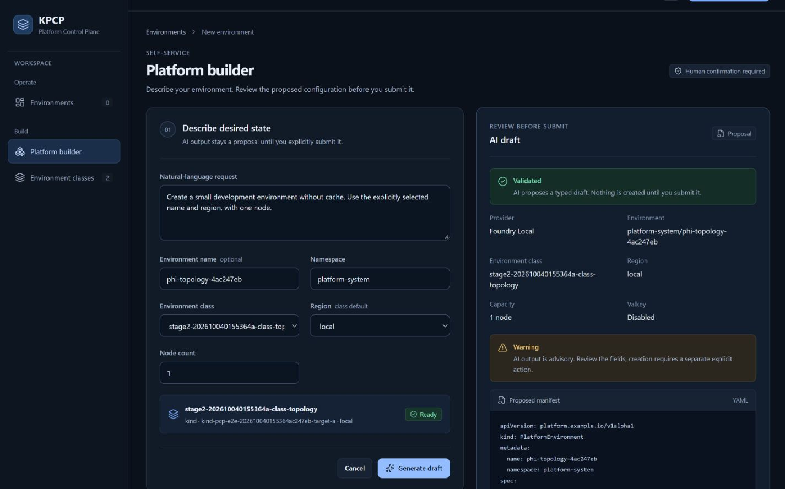
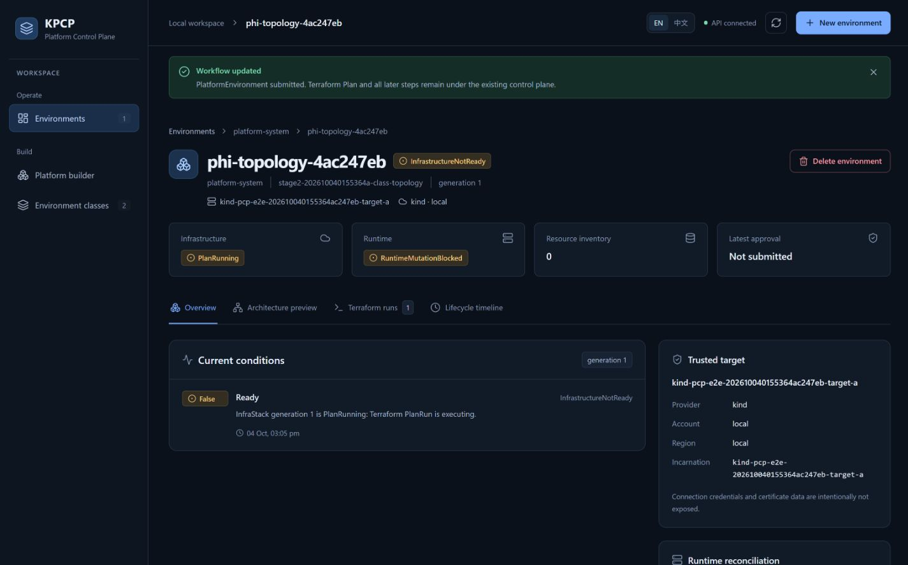
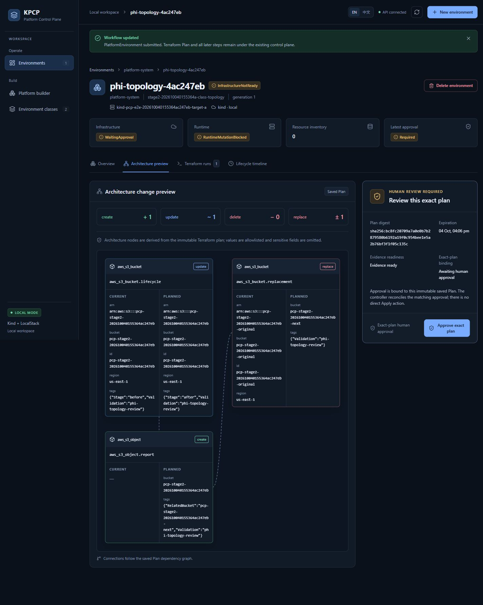
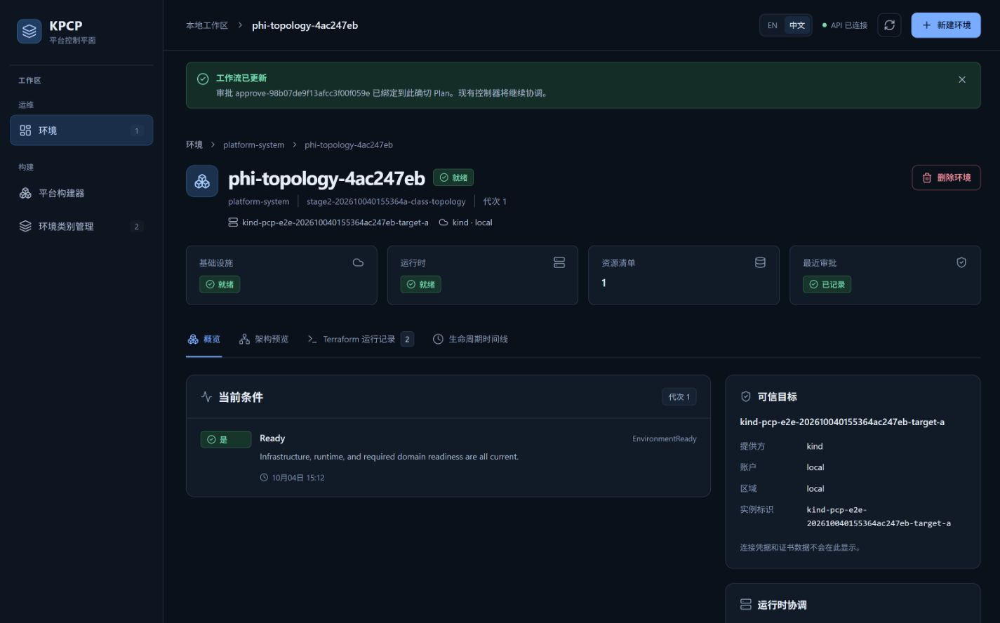
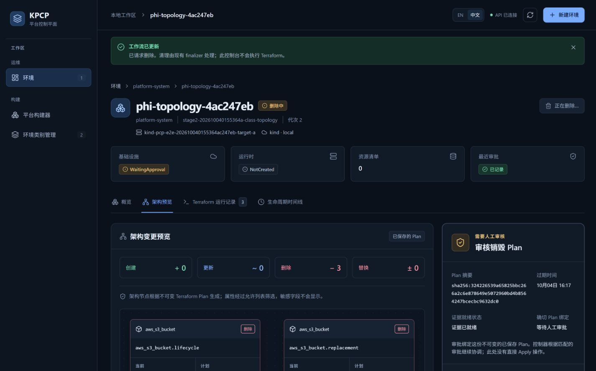
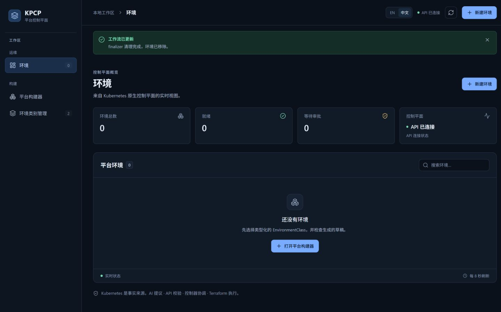

# 前端补充验证：Foundry Local、真实 Plan 与多资源拓扑

验证日期：2026-10-04（Pacific/Auckland）。代码版本：`f4d6457377c699156310f5f9e2609e126cc4b7ef`。

`UI_REDESIGN_RESULT = PASS`（本地前端及本轮补充验证）。

## 1. 测试验证项目

| 验证项目 | 实测结果 |
| --- | --- |
| Foundry Local + phi-4-mini：网页 Generate draft → Submit | **PASS**；提供器显示 Foundry Local，草稿 Validated，提交后产生真实 PlatformEnvironment |
| CREATE / UPDATE / REPLACE 的 PlanTopology | **PASS**；同一真实 Terraform Plan 包含三种动作各 1 项 |
| 多资源 PlanTopology | **PASS**；3 个节点、2 条依赖连线，当前/计划属性与真实 Plan 一致 |
| 中英文，1440 / 1280 / 1024 / 768 宽度 | **PASS**；8 组检查无节点重叠、无页面横向溢出，连线端点误差均为 0 |
| build / typecheck / lint | **PASS**；三个命令均退出 0 |
| 确切 Plan 审批 → Apply → Ready | **PASS**；实际 LocalStack 创建、更新、替换结果通过检查 |
| 独立 Destroy 审批与测试清理 | **PASS**；执行退出 0，finalizer 自动返回列表，资源及会话清理完成 |
| 临时 reference repo 删除被策略阻止 | **NON-PRODUCT BLOCKER**；不作为产品 PARTIAL 的依据 |

本轮只补验证和证据，未修改设计、前后端源码、API、控制器、CRD 或功能。验证使用 Kind + LocalStack，不代表真实 AWS 或生产环境通过。

## 2. 测试准备与参数

### 2.1 Foundry Local

在 PowerShell 运行：

```powershell
foundry server status -o json
foundry model list --loaded --variants -o json
```

本轮实际值：

| 参数 | 本轮值 / 填写规则 |
| --- | --- |
| 服务状态 | `running: true`、`state: ready` |
| 服务地址 | `http://127.0.0.1:59656`；每次以 `webUrls` 为准，不能沿用旧端口 |
| 模型别名 | `phi-4-mini` |
| 实际加载 variant | `Phi-4-mini-instruct-generic-cpu:5` |
| 运行设备 / 后端 | `Cpu` / `CPUExecutionProvider` |
| API `AI_PROVIDER` | `foundry-local` |
| API `FOUNDRY_LOCAL_ENDPOINT` | 上述实际服务地址 |
| API `FOUNDRY_LOCAL_MODEL` | `Phi-4-mini-instruct-generic-cpu`，本轮 `/v1/models` 返回的模型 ID |

这些是验证 API 的启动参数。Foundry Local 已在运行，本轮未重启或更换模型；没有使用 deterministic 提供器代替成功结果。

### 2.2 可执行类别与真实多资源前置数据

测试类别必须具有真实可用的 Git source、S3 backend、runner 和 Kind target。仅在表单中填写一个 ConfigMap 名称不足以执行 Plan。现有本地会话入口：

```powershell
./e2e/Run-Stage1E2E.ps1 -Suite all -Stage2Session
```

本轮浏览器会话 `20261004015536-4ac247eb` 使用相同现有脚手架和当前源码镜像；因上一轮系统 Temp kubeconfig 消失，临时状态改存项目的忽略目录。会话没有冒充第二次完整 E2E 套件运行。

开发准备多资源测试数据，测试人员再按第 3 节操作网页：

1. 在会话拥有的 LocalStack 中建立主桶 `<bucket>`，标签 `Stage=before`、`Validation=phi-topology-review`，再建立 `<bucket>-original`。
2. 在临时 Git 测试源中使用以下资源；保留已有 provider、变量和 backend 配置：

```hcl
resource "aws_s3_bucket" "lifecycle" {
  bucket        = var.bucket_name
  force_destroy = true
  tags = { Stage = "after", Validation = "phi-topology-review" }
}

resource "aws_s3_bucket" "replacement" {
  bucket        = "${var.bucket_name}-next"
  force_destroy = true
  tags = { Validation = "phi-topology-review" }
}

resource "aws_s3_object" "report" {
  bucket  = aws_s3_bucket.lifecycle.id
  key     = "plan-topology-validation.txt"
  content = "Disposable local validation resource."
  tags = {
    Validation    = "phi-topology-review"
    RelatedBucket = aws_s3_bucket.replacement.bucket
  }
}
```

3. 使用该类别同一个远程 S3 backend，建立与环境名称相同的 Terraform workspace，将真实前置桶导入状态：

```powershell
# 在临时测试源目录执行；backend.hcl 取会话实际 backend 配置。
# 本机导入时 LocalStack endpoint 使用 localhost:4566。
$env:AWS_ACCESS_KEY_ID = 'test'
$env:AWS_SECRET_ACCESS_KEY = 'test'
$env:AWS_DEFAULT_REGION = 'us-east-1'
$env:TF_VAR_s3_endpoint = 'http://localhost:4566'
terraform init -backend-config=backend.hcl -input=false
terraform workspace new <与网页填写完全相同的环境名称>
terraform import aws_s3_bucket.lifecycle <bucket>
terraform import aws_s3_bucket.replacement <bucket>-original
```

4. 把临时测试源提交到会话的本地 Git server，将复制的新类别 source revision 固定到该提交，等待类别 Ready。本轮提交为 `12bdc8ee0b661d50e834d712cee764df4cb396c6`。

前置导入只建立真实资源与 Terraform 状态对应关系。Plan、审批、Apply、Destroy 由现有产品链路完成；没有伪造 Plan JSON、注入网页数据或手改 Terraform state。

## 3. 网页测试步骤与截图

### FV-01｜生成 Foundry 草稿

1. 打开 `http://127.0.0.1:5173/`，确认 **API connected / API 已连接**。
2. 左侧点击 **Platform builder / 平台构建器**。
3. 填写以下参数。本轮名称和类别已经随测试清理；复测时使用新会话实际类别及新唯一名称。

| 页面字段 | 本轮填写 |
| --- | --- |
| Natural-language request | `Create a small development environment without cache. Use the explicitly selected name and region, with one node.` |
| Environment name | `phi-topology-4ac247eb` |
| Namespace | `platform-system` |
| Environment class | `stage2-202610040155364a-class-topology`，必须是 Ready 的可执行测试类别 |
| Region | `local`，来自该类别区域选项 |
| Node count | `1` |

4. 点击 **Generate draft / 生成草稿**，等待右侧显示 **Validated**。
5. 检查 Provider 为 **Foundry Local**，环境名称、命名空间、类别、区域、1 node、Valkey Disabled 与填写一致。
6. 此时侧栏环境数量仍为 **0**，生成草稿未创建资源。



### FV-02｜明确提交环境

1. 向下查看草稿 YAML。
2. 点击 **Submit PlatformEnvironment / 提交 PlatformEnvironment**。
3. 页面进入环境详情，侧栏环境数变为 1；初始显示 PlanRunning。
4. 等待 Plan 证据就绪，基础设施进入等待审批；审批前实际 Apply 数量为 **0**。



### FV-03｜检查三种动作、多资源节点及连线

1. 点击 **Architecture / 架构预览**。
2. 检查变更摘要：**CREATE 1、UPDATE 1、DELETE 0、REPLACE 1**。
3. 检查三个节点的动作及属性：

| 节点 | 动作 | 当前 → 计划 |
| --- | --- | --- |
| `aws_s3_bucket.lifecycle` | UPDATE | tags `Stage=before` → `Stage=after` |
| `aws_s3_bucket.replacement` | REPLACE | bucket 后缀 `-original` → `-next` |
| `aws_s3_object.report` | CREATE | 当前为空，计划 bucket 指向主桶；tags 引用 `-next` 桶 |

4. 检查 **2 条真实依赖线**：主桶 → object、替换桶 → object。线端应连接卡片边界，卡片不能相互重叠。
5. 在 EN、中文下分别使用 `1440×1000`、`1280×1000`、`1024×1000`、`768×1000` 视口复查。拓扑容器可横向滚动，整页不应横向溢出。

| 语言 | 1440 | 1280 | 1024 | 768 |
| --- | --- | --- | --- | --- |
| EN | PASS | PASS | PASS | PASS |
| 中文 | PASS | PASS | PASS | PASS |

每组均为 3 节点、2 条线；实测连线端点相对卡片边界最大误差 **0 px**。




### FV-04｜审批后检查实际效果

1. 核对审核门显示证据就绪、有变更、Plan 未过期。
2. 点击 **Approve this exact Plan / 批准此确切 Plan**。
3. 等待概览显示环境、基础设施和运行时均 Ready，资源清单为 1。
4. 运行记录中 Apply 应为 Succeeded，且 planDigest 与获批 Plan 相同。

本轮 Plan UID：`4f089a78-b336-4ae8-93dd-f82366a1dcbb`。审批：`approve-98b07de9f13afcc3f00f059e`。

开发通过 LocalStack 读取实测效果：

- 主桶 tags 已为 `Stage=after`：UPDATE 通过。
- 主桶存在 `plan-topology-validation.txt`，内容长度 37：CREATE 通过。
- `-next` 桶存在、`-original` 桶返回 404：REPLACE 通过。



### FV-05｜独立销毁审批和清理

1. 点击 **删除环境**，输入完整环境名称 `phi-topology-4ac247eb`，点击 **请求删除**。
2. 等待 runtime prune；页面出现独立 Destroy Plan，摘要为 **DELETE 3**。
3. 创建审批不能沿用。本轮 Destroy Plan UID 为 `57cf198c-8f96-4036-9039-604e3106cb7f`，审批前无 Destroy 模式 Apply。
4. 点击该 Destroy Plan 的 **批准此确切 Plan**，本轮独立审批为 `approve-769b7137536513e5a54c8682`。
5. 等待 finalizer 完成，页面应自动返回环境列表；核对环境和目标 runtime Service 消失，本轮三个测试桶均不存在。



实际清理与恢复结果：

- Destroy 执行 `terraformExitCode=0`、`executionOutcome=Succeeded`，执行 Plan 摘要与独立获批 Destroy Plan 一致。
- 环境消失，三个测试桶均不存在；既有脚本在删集群前保存的目标全命名空间快照中，`default/stage2-202610040155364a-svc` 已消失。
- 网页未手动刷新或导航，通过轮询自动返回列表并显示 **finalizer 清理完成，环境已移除。**
- 会话 `BROWSER_SESSION_CLEANUP=PASS`、退出 0；三个测试 Kind 集群、会话桶和临时状态已清理。
- 原 `pcp-dev` API、控制器及 Vite 可达，原环境/类别/模板数量均为 0；Foundry 原 PID 13032 保留，LocalStack healthy。
- 原开发 API 使用原可执行文件及原 kubeconfig 恢复；忽略目录的恢复包装脚本使用 Foundry 当前地址 `59656` 和实测模型 ID，原启动文件未修改。测试视口已复原。



## 4. 构建检查

在项目根目录执行，三个命令本轮均退出 **0**：

```powershell
npm --prefix web run build
npm --prefix web run typecheck
npm --prefix web run lint
git diff --check
```

`lint` 是仓库原有 `tsc --noEmit`。本轮未替换脚本或增加测试框架。

## 5. 原始证据与异常记录

证据位于 [本轮证据目录](验收截图/20261004前端补充验证/证据)：Foundry 实际加载模型、真实 PlanGraph、8 组节点/端点测量、审批前后数据、LocalStack 效果、构建日志、浏览器检查记录。

- 额外完整套件尝试 `20261003222621-bc5384bd`：FULL_LIFECYCLE、RESTART_RECOVERY、UPDATE_RUNTIME、UPDATE_DELETE、MULTI_TARGET、FAIL_CLOSED 均 PASS；等待浏览器会话期间系统 Temp 的 kubeconfig 消失，总结果 **FAIL**，原因未查明；CLEANUP 为 PASS。本轮另建隔离浏览器会话完成上述补充验证，不将其记为第二次完整套件 PASS。
- 浏览器原始记录保留一次 FAIL：检查脚本对快照 JSON 转义的匹配错误。随后直接读取可见卡片文本复核 PASS，实际当前/计划值正确，未修改产品源码。
- 最终恢复计数重新使用源码中的实际 `/api/classes`、`/api/class-templates` 路由读取；目标 Service 清理使用删集群前的全命名空间快照复核，覆盖其真实 `default` 命名空间。
- 部分 fullPage 截图调用失败，改用正常视口截图。英文多资源完整长图成功保存；所有 8 组布局检查均使用实际 DOM 几何数据。
- 临时参考仓库 `C:\Users\weila\AppData\Local\Temp\kpcp-ui-reference-20261004` 删除两次返回 `blocked by policy`，没有更具体原因。此项标记 **NON-PRODUCT BLOCKER**，未再绕过策略尝试，不因此把产品判为 PARTIAL。
