# 网页手动测试：环境类别、模板与环境生命周期

**类别与模板：** 2026-10-03/04 已实测，40 项浏览器检查通过；本次再次核对入口、预设字段和未校验按钮禁用。\
**环境生命周期：** 步骤按当前代码整理，截图来自 2026-10-02/03 的历史验收，本次未重跑 Plan / Apply / Destroy。

## 一、验证类别与模板

### CT-01｜打开页面、选择预设

1. 打开 <http://127.0.0.1:5173/#classes>，确认 **API 已连接**，右上角选 **中文**。
2. 左侧 **环境类别管理 → 创建类别 → Kind · 小型开发 → 使用模板**。
3. 核对预设：最少节点 1、最多节点 3、环境上限 3、Plan 上限 1、Apply 上限 1、人工审批。
4. 点 **重新选择模板（重置草稿）**，改选 **Kind · 团队开发**；对应值应为 `1 / 10 / 10 / 2 / 1 / 人工审批`。
5. **从空白表单开始**可用于自行填写；必填项为空不能通过校验。
6. 未校验时，**保存为模板**与**创建类别**应禁用。回到小型预设，按下面表格填写。


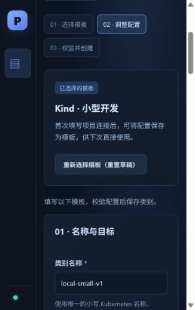

### CT-02｜填写参数、验证输入限制

首次测试使用下表；后续直接选项目模板。把名称后缀 `20261003-r1` 换成自己的唯一后缀，同一轮删除确认使用完全相同的名称。

**这组数据只验证类别和模板管理。`ui-e2e-backend` 没有实际创建，不能直接用来部署环境。**

| 页面字段 | 本轮输入 / 怎么填 |
| --- | --- |
| 类别名称 | `ui-class-small-20261003-r1`；唯一小写名称，字母、数字、短横线，字母或数字开头结尾 |
| 版本 | `v1`；类别配置版本，不是 Git 提交哈希；改版本还须取新类别名称 |
| 提供方 | `Kind` |
| 目标集群 / 上下文 | `kind-pcp-dev`；由开发提供控制器已配置的 kubeconfig 上下文，不是容器名 |
| 账户 | `local` |
| 默认区域 | `local` |
| 可选区域 | `local, local-secondary`；英文逗号分隔，不能重复，必须包含默认区域；空白表示不限制 |
| 基础设施仓库地址 | `https://github.com/miku-wwl/kube-platform-control-plane.git`；不要填本机路径或含口令的 URL |
| 固定来源提交版本 | `814d245fa00ecad8bad0f71a9844f55b25a54605`；完整 40–64 位十六进制哈希，不能填 main、标签或短哈希 |
| Terraform 目录 | `test/fixtures/terraform/localstack-basic`；相对来源仓库，用 `/`；仓库根目录填 `.` |
| 后端配置名称 | `ui-e2e-backend`；填含 backend.hcl 的 ConfigMap 名称，不是桶名或配置全文；实际执行前须在环境命名空间准备好 |
| Runner 服务账户 | `terraform-runner`；填 Kubernetes ServiceAccount 名称，实际执行前由开发准备账户和权限 |
| Runner 镜像 | `platform-terraform-runner:local-20261002113306-53dc5e11`；换机器或做实际执行时使用开发提供的项目 Runner |
| Runner 镜像摘要 / 本地标识 | `sha256:8a0eb44312d04ff3b05c7e44cc42401a8f790121a6fd757d9dc6fc9bbd1951c8`；这是上述本机镜像的 Image ID，不是仓库 manifest digest；实际执行须匹配真实镜像 |
| Terraform 版本 | `1.14.0`；实际执行须与 Runner 内版本一致 |
| 执行超时 | `12m`；带时间单位且大于 0，如 `1h`；不能填 `12分钟` |
| 最少 / 最多节点数量 | `1 / 3`；非负整数，最少不得大于非零上限 |
| 环境数量上限 | `3` |
| 同时 Plan / Apply 数量上限 | `1 / 1`；上限 0 表示类别不单独限制，仍受控制器总限制 |
| 审批策略 | `人工审批`；Automatic 可保存，但当前没有自动审批实现，执行仍需要 ChangeApproval |

`local-secondary` 只用于验证区域选项，不代表另一个真实地区或集群。创建类别不会拉取仓库、运行镜像或执行 Terraform。

展开 **高级执行与运行时配置**：

| 字段 | 测试值 / 填写方法 |
| --- | --- |
| 锁等待超时 | `2m`；保留默认，必须为正 |
| 执行器工作目录 | `/workspace/terraform`；Runner 容器内目录，不是 Windows 路径，不能清空 |
| Terraform 并行数量 | `2`；可以留空，指定时为正整数 |
| 运行系统 / 运行架构 | `linux / amd64`；可留空，实际值由开发按 Runner 平台提供 |
| 集群标识 / 集群实例标识 | 留空；Kind 后续目标物化从集群名称取默认标识，自定义值由管理员提供 |
| 连接配置引用 | 留空；Kind 默认连接为 `kubeconfig:kind-pcp-dev`，不粘贴 kubeconfig 全文 |
| 管理角色 ARN | Kind 留空；由管理员提供其他执行场景的身份 |
| Valkey 镜像 | 留空；仅填此字段不会生成缓存资源 |
| Operator 镜像 / 镜像摘要 / 清单引用 | 留空；目前只保存这些配置，不会据此自动部署 Operator |
| 网络策略配置 | 留空；目前只保存，不会据此自动部署策略 |
| 数据保留策略 | 留空；目前没有消费此字段的删除策略实现 |
| 运行时资源（JSON，可选） | 基础用例用 `[]`；验证高级参数保留使用下面数组；不能填 YAML 或内嵌 Secret |
| AWS EKS 额外字段：集群 ARN、基础设施执行角色 ARN、运行时访问角色 ARN | 本轮不切换 AWS、不填写；真实值与权限由管理员提供 |

保留性测试使用以下安全 JSON；它应保存到配置中，**不应因保存模板或创建类别就在集群中产生 ConfigMap**：

```json
[
  {
    "version": "v1",
    "resource": "configmaps",
    "object": {
      "apiVersion": "v1",
      "kind": "ConfigMap",
      "metadata": { "name": "ui-template-marker", "namespace": "default" },
      "data": { "purpose": "class-template-ui-e2e" }
    }
  }
]
```

1. 填好后，每次只改下表的一项，点 **校验配置**，验证拒绝结果。
2. 每个负例测完恢复正确值；最后全部正确，再校验。
3. 应显示 **配置校验通过**，可展开 YAML，保存模板和创建类别按钮启用。
4. 随便修改版本，两个保存按钮应重新禁用；恢复原值也必须重新校验。

| 错误输入 | 应看到的结果 |
| --- | --- |
| 固定提交改成 `main` | `source.revision` 需要固定完整提交哈希 |
| 默认区域 local，可选区域只填 local-secondary | 默认区域必须在可选区域中 |
| 最少节点 4、最多节点 3 | 最小节点数不能超过最大节点数 |
| 运行时 JSON 填 `{}` | 要求资源定义组成的 JSON 数组 |
| 下方虚构 Secret 负例 | 拒绝内嵌 Secret / 凭据，不保存 |

```json
[{"version":"v1","resource":"secrets","object":{"apiVersion":"v1","kind":"Secret","metadata":{"name":"ui-rejected-secret"},"stringData":{"password":"ui-test-only"}}}]
```

**通过标准：** 错误配置不能保存；正确配置通过真实 Kubernetes dry-run；校验本身不新增类别、环境、TerraformRun 或运行时资源。


### CT-03｜保存项目模板、拒绝重复名称

1. 正确配置校验后点 **保存为模板**，按下表填写，再点面板内 **保存模板**。
2. 应显示 **模板已保存**，类别草稿仍保留；没有创建类别或环境。
3. 再保存同名模板，显示名称改为 `重复名称不应覆盖原模板`，应报重名错误，原标题不变。
4. 取消重名保存面板，保留类别草稿继续 CT-04。

| 字段 | 填写值 / 规则 |
| --- | --- |
| 模板名称 | `ui-project-20261003-r1`；唯一小写机器名称，字母数字短横线，最多 63 字符，首尾为字母数字 |
| 模板显示名称 | `网页验收 · 小型开发`；可以中文，必填，最多 120 字节；不是删除确认名称 |
| 模板说明 | `首次配置后复用仓库、镜像、区域和运行时参数`；可空，最多 1000 字节 |

**通过标准：** 只新增管理集群 `default/pcp-class-template-ui-project-20261003-r1`，不覆盖同名模板。修改模板时选原模板，调整草稿并以新模板名称保存。


### CT-04｜创建类别、等待 Ready、选择区域

1. 在原草稿点 **创建类别**；参数改过则先重新校验。
2. 等页面下一次刷新，类别应为 **就绪**，控制器条件 **Ready: 是 · ClassValidated**，**使用此类别**可点。
3. 点 **使用此类别**；平台构建器应自动选择刚创建的类别。
4. 区域应有 `使用类别默认值 (local)`、`local`、`local-secondary`；选择 local-secondary，应显示该值。
5. 返回类别管理。这里只验证选项，不用这组引用型参数提交实际环境。

**通过标准：** 类别真正存入 Kubernetes，控制器处理后可选；尚无 PlatformEnvironment、TerraformRun 或运行时标记。类别 Ready 不代表后端及 Runner 已可运行。


### CT-05｜选择项目模板，只改四项

1. **创建类别 → 我的项目模板 → 网页验收 · 小型开发 → 使用模板**。
2. 来源、后端与 Runner 应已填好并折叠；展开核对固定提交和镜像。
3. 类别名称改为 `ui-class-copy-20261003-r1`，版本改为 v2，默认区域改为 local-secondary，最多节点改为 5；其余不改。
4. 高级参数 parallelism=2、linux、amd64、运行时 JSON 应保留。
5. 暂改类别名称为原类别名称，校验应拒绝重名；恢复新名称，**校验配置 → 创建类别**，等待 Ready。
6. 原类别与原模板应仍为 **v1 / local / 最大 3**；新类别为 **v2 / local-secondary / 最大 5**。


### CT-06｜已有类别复制、中英文切换

1. **创建类别 → 从已有类别创建 → ui-class-copy-20261003-r1 → 作为模板使用**。
2. 应建议新名称 `ui-class-copy-20261003-r1-next`、版本 `v2-next`，保留区域与最大 5；重名时自动加后缀。
3. 切到 EN 再切回中文，填写值不能丢失。
4. 校验、创建第三个类别，等待 Ready。
5. 在其详情点 **复制为新版本**，应产生另一份新名称、新版本草稿；点取消，不创建第四个类别。


### CT-07｜刷新及 API 重启后的模板持久化

1. 保存模板后取消未保存草稿，刷新浏览器，再进入模板选择。
2. 模板应仍存在；使用后固定提交、运行时 JSON 和高级执行参数保留。
3. 开发人员记录模板 ConfigMap UID，仅重启 API，保留 Kind 集群。
4. API 恢复后刷新页面；模板仍可复用，UID 必须不变。

**通过标准：** 本轮实际 API 重启前后 UID 相同，模板没有依赖浏览器草稿内存。


### CT-08｜删除身份与引用保护

| 验证项目 | 测试步骤 | 通过标准 / 已验证范围 |
| --- | --- | --- |
| 模板过期 UID | 开发人员调用模板 DELETE，传精确名称和错误 UID | 409，模板保留；本轮真实 API 已验证 |
| 类别过期 UID | 类别 DELETE 传精确名称和错误 UID | 409，类别保留；本轮真实 API 已验证 |
| 类别有环境引用 | 使用本轮自己的可执行测试环境，查看其类别引用数和删除按钮 | 有引用时不可删；本轮只有现有 API / 控制器契约测试通过，未测此网页分支 |

无测试环境时不操作用户已有环境，不手动移除 finalizer。名称确认界面见 CT-09、CT-10 截图。

### CT-09｜删除模板，保留已有类别

1. 在模板卡片点 **删除模板**。
2. 确认框填显示标题 `网页验收 · 小型开发`，按钮应禁用。
3. 改填机器名称 `ui-project-20261003-r1`，按钮才能启用；确认删除。
4. 模板卡片消失，三个已创建类别仍存在且 Ready，配置不变。


### CT-10｜删除类别、完成测试清理

1. 先打开第三个类别 `ui-class-copy-20261003-r1-next`，引用数应为 0，点 **删除类别**。
2. 输入不完整名称，确认按钮应禁用；输入完整名称后确认删除。
3. 等该类别从列表消失，再删除第二个类别与原类别。
4. 页面类别数应归零，项目模板为空，两个内置预设仍保留。
5. 开发人员核对无测试类别、模板 ConfigMap、PlatformEnvironment、TerraformRun；`ui-template-marker` 未部署。


## 二、验证完整环境生命周期

**执行前：** 开发人员提供可运行的本地类别、环境命名空间的 backend.hcl ConfigMap、Runner 服务账户/镜像、LocalStack 状态和证据桶、目标连接、Foundry Local，以及启用 Terraform 执行的控制器。不能使用 CT-02 的占位后端。可用现有 `e2e/Run-Stage1E2E.ps1 -Suite all -Stage2Session` 准备受控本地会话，再将该会话类别保存为项目模板。

**以下截图与结果来自 2026-10-02/03，属于历史实测，本次文档更新未重新执行。** 按当前网页按钮整理的复测步骤如下。

### ENV-01｜生成草稿、明确提交

1. **平台构建器**选择开发提供的 Ready 类别，区域选类别默认值。
2. 名称填自己的唯一值，如 `web-env-20261004-qa1`；命名空间填开发准备后端和账户的命名空间；节点数填 1。
3. 自然语言填 **一个节点、不要缓存的小型开发环境**，点 **生成草稿**。
4. 检查 YAML 中名称、命名空间、类别、区域、节点数，确认校验通过。
5. 提交前不应存在该环境；点 **提交 PlatformEnvironment** 后才应出现。

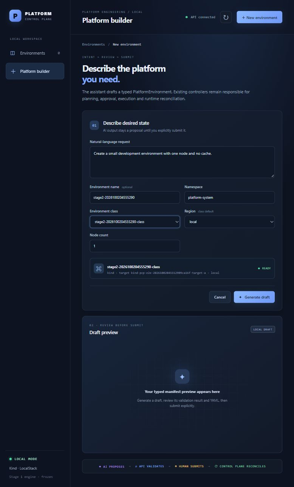

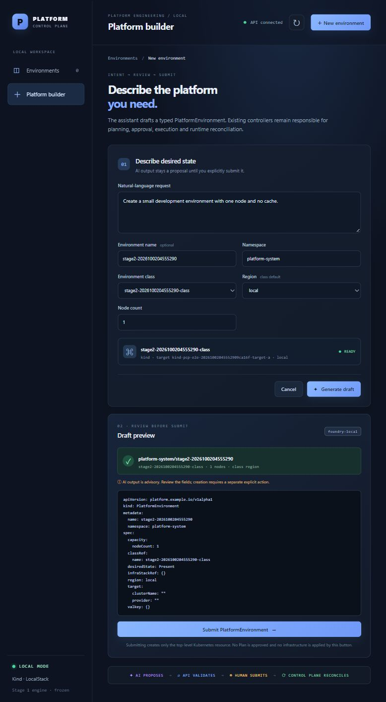

### ENV-02｜审核计划、精确审批

1. 提交后进入环境详情的架构/计划页面，等待 Plan 成功并显示变更。
2. 使用 LocalStack basic fixture 时，应预览新增一个存储资源；其他模板以实际预期清单为准。
3. 审批前不应有对应 Apply 或新增存储资源；核对当前 Plan 后点 **批准此确切 Plan**。
4. 页面应显示 **审批已记录 / Recorded**；后续执行由控制器推进。
5. 开发人员核对审批绑定当前 Plan UID、摘要、输入、报告，Apply 使用原保存计划。

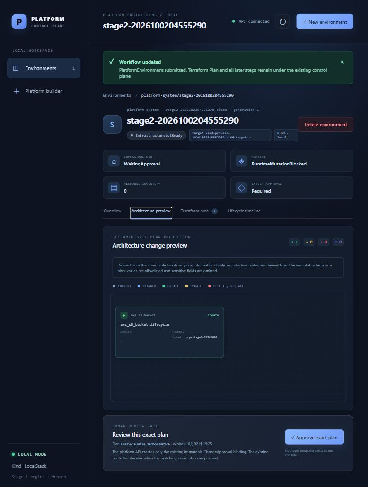

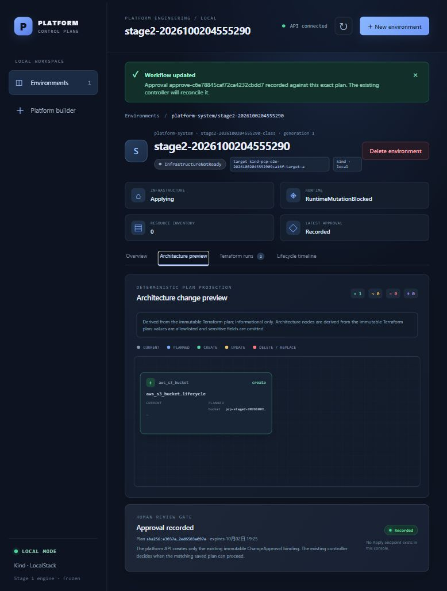

### ENV-03｜Apply、运行时和环境就绪

1. 在 Terraform 执行记录等待 Apply 成功、退出码 0。
2. 详情条件应为当前代数 Ready；运行时 Ready，资源清单出现预期对象。
3. 开发人员查询 LocalStack 存储资源、目标 Kubernetes Service，确认实际存在。
4. 左侧环境总览应显示该环境就绪；仅看到 Job 完成不算环境 Ready。

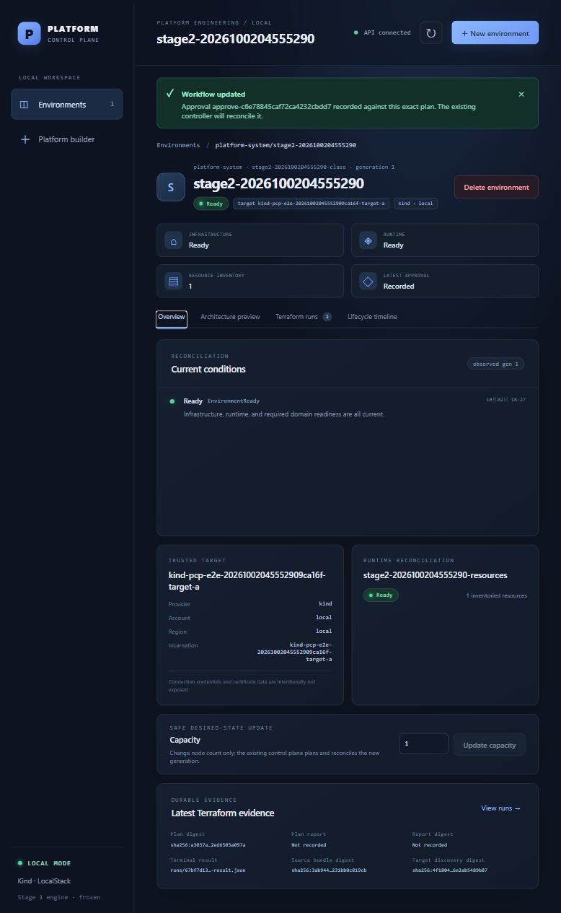

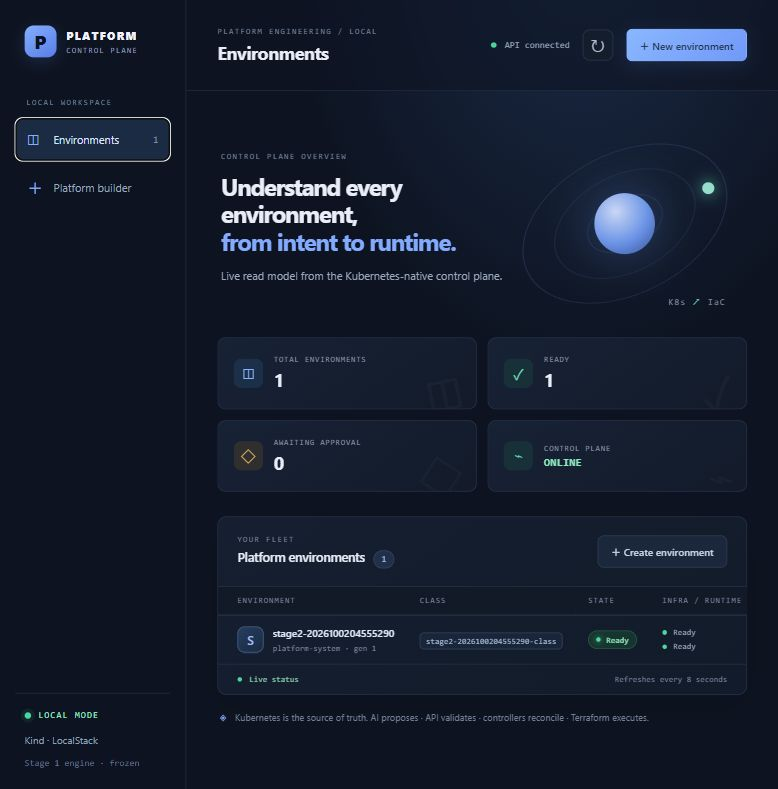

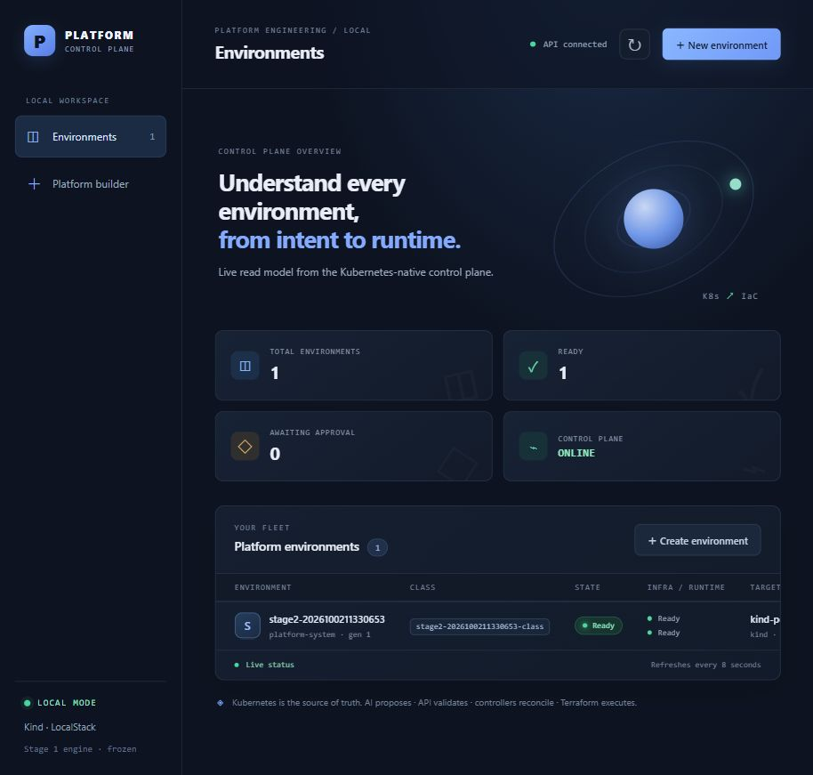

### ENV-04｜更新节点数量

1. 详情容量从 1 改为 2，点 **更新容量**。
2. 等新代数与新 Plan 收敛，环境应重新 Ready。
3. 该 basic fixture 的节点数不映射为新增基础设施，预期 NoChange；Apply 仍为 1，原 Service UID 和存储资源不变。

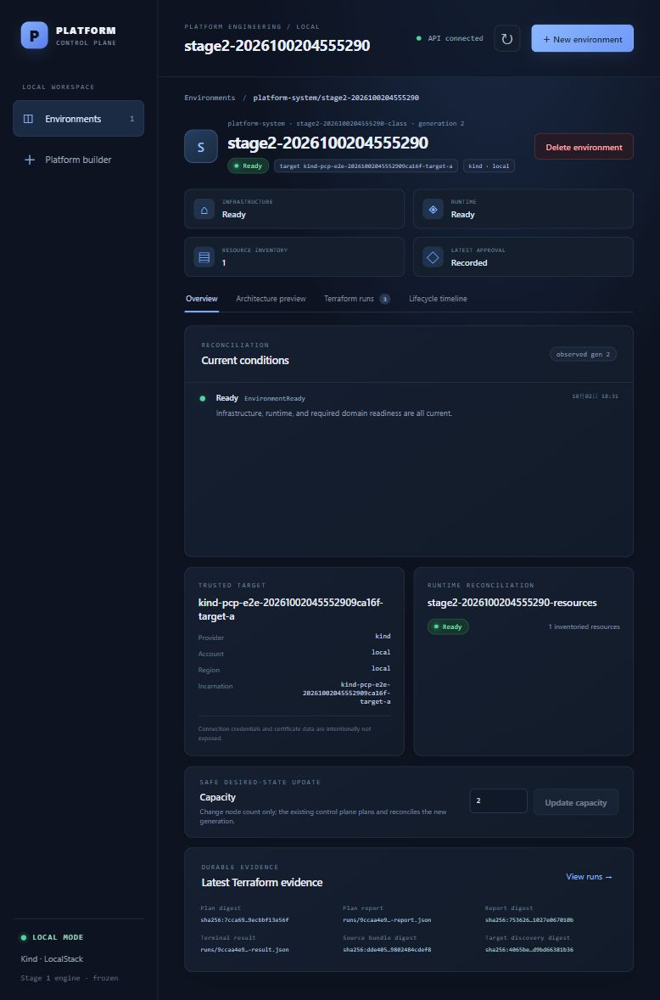

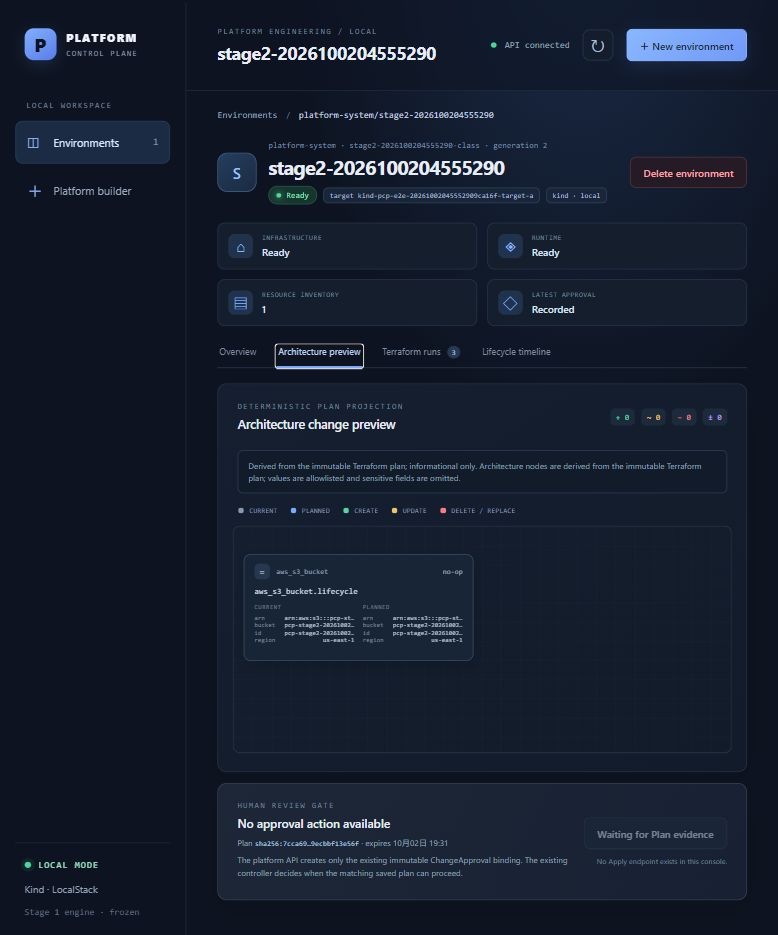

### ENV-05｜执行记录和时间线

1. 打开 Terraform 执行记录，检查创建 Plan、成功 Apply 和更新 Plan。
2. 打开生命周期时间线，检查提交、审批已记录、执行成功和更新结果。
3. 页面记录应与实际对象/执行终态一致；时间线不是全部状态转换的审计日志。

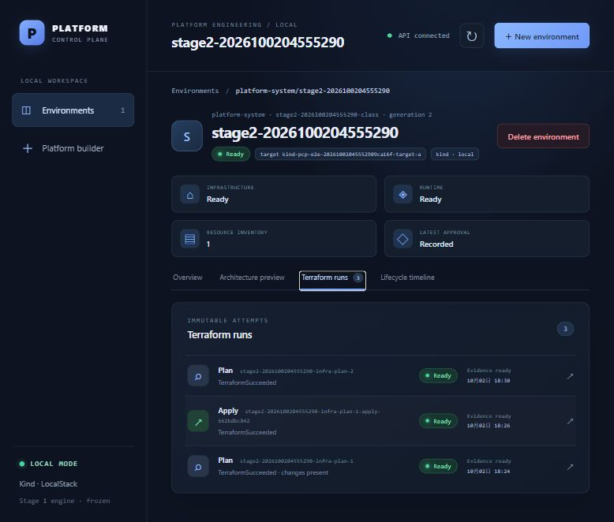

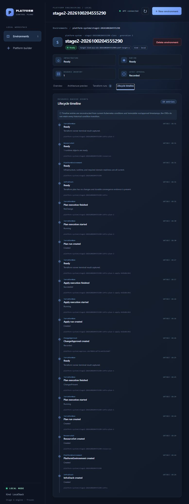

### ENV-06｜删除确认、独立 Destroy 审批

1. 点 **删除环境**，输入错误名称，**请求删除**应禁用。
2. 输入完整环境名称后请求删除。运行时应裁剪；销毁审批前存储资源仍存在，且没有销毁 Apply。
3. 在计划页面检查 Destroy 只删除本轮预期资源，单独点 **批准此确切 Plan**。
4. 应显示销毁审批已记录，旧创建审批不能代替本次审批。

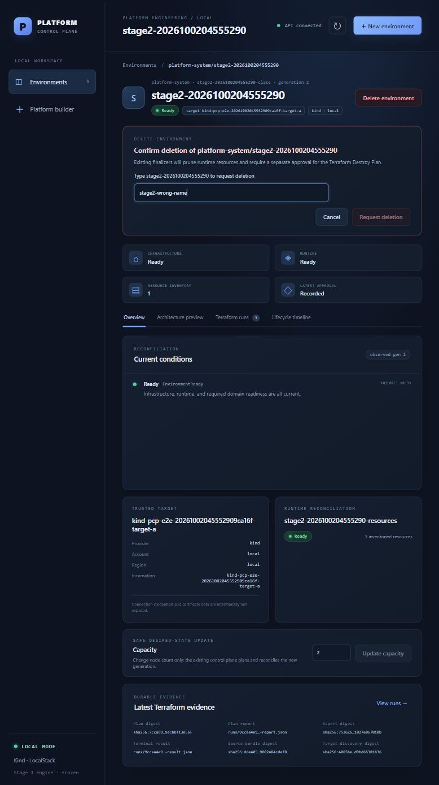

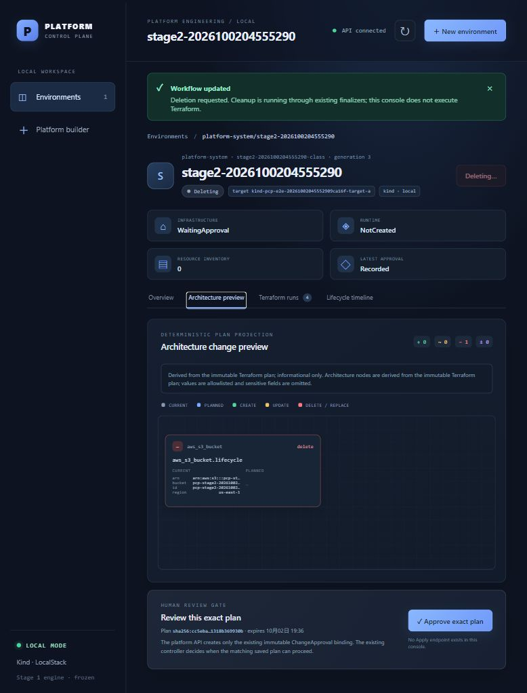

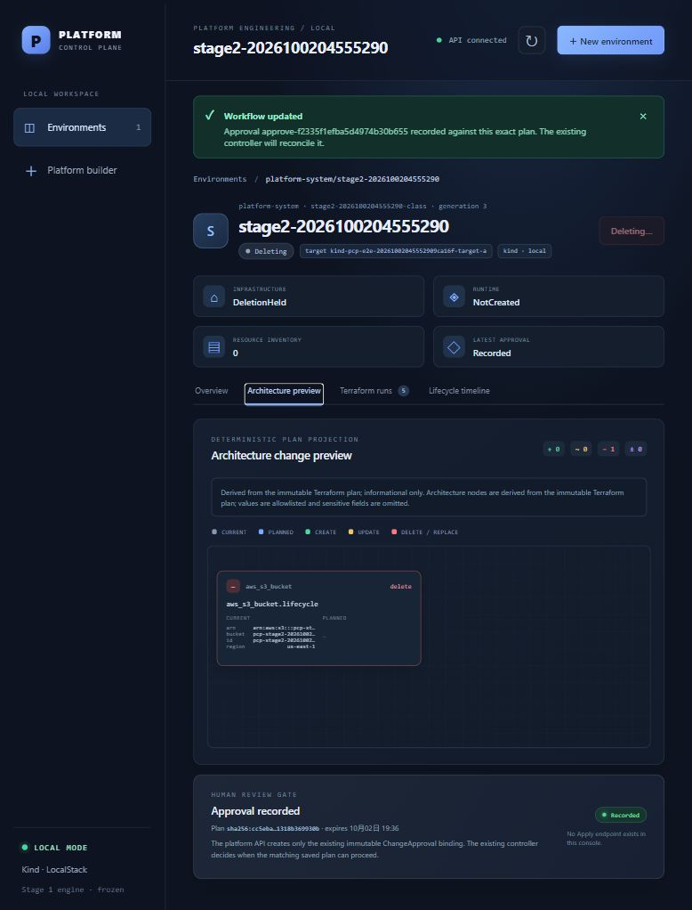

### ENV-07｜最终清理

1. 等 Destroy 执行成功、退出码 0，环境从列表消失。
2. 开发人员核对环境、InfraStack、ResourceSet、目标 Service 均不存在，本轮存储资源不存在。
3. 页面环境数应归零；本轮环境引用释放后，才可删除其测试类别/模板。

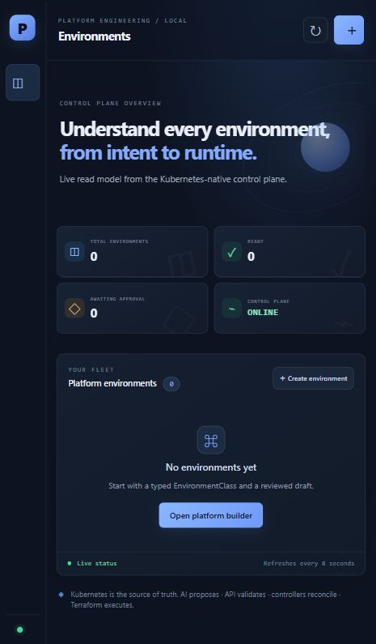

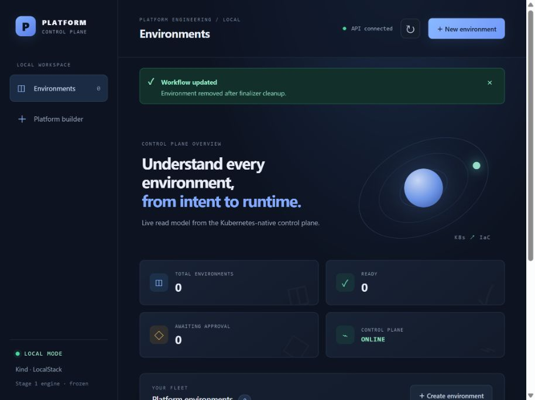

## 三、复测问题核对

| 现象 | 操作 |
| --- | --- |
| 类别/区域没有值 | 先创建 Ready 类别；区域来自该类别的可选区域；模板不会自动成为类别 |
| 校验后按钮灰色 | 查看错误并重新校验；任何字段修改都会使旧校验失效 |
| 类别一直等待 | 检查控制器是否运行，API 和控制器是否使用同一 kubeconfig；页面约每 8 秒刷新 |
| 同名保存报错 | 换唯一名称；类别及模板不会覆盖已有配置 |
| 类别 Ready，环境执行失败 | 核对真实后端、Runner、来源和目标；Ready 不证明这些依赖可运行 |
| 删除模板按钮灰色 | 输入机器名称，不是中文显示标题 |
| 删除类别按钮灰色 | 检查引用数和删除状态，先完成本轮环境的正常删除 |

开发人员只读查询（在仓库根目录执行）：

```powershell
Invoke-RestMethod http://127.0.0.1:8090/api/health
Invoke-RestMethod http://127.0.0.1:8090/api/classes
Invoke-RestMethod http://127.0.0.1:8090/api/class-templates
kubectl --kubeconfig tmp/kubeconfig-pcp-dev.yaml get environmentclasses
kubectl --kubeconfig tmp/kubeconfig-pcp-dev.yaml get platformenvironments,terraformruns,infrastacks,resourcesets -A
kubectl --kubeconfig tmp/kubeconfig-pcp-dev.yaml -n default get configmap -l platform.example.io/configuration-kind=class-template
```

首次项目参数由开发人员提供：来源仓库完整提交用 `git rev-parse HEAD`；上下文用 `kubectl config get-contexts -o name`；后端/服务账户查目标环境命名空间；本地镜像用 `docker image inspect <镜像> --format '{{.Id}}'`，发布镜像查 RepoDigests。名称查询不能证明执行权限或镜像可运行。
