# 环境类别与模板网页手动测试及验收报告

**验收日期：** 2026 年 10 月 3–4 日（新西兰时间，10 月 4 日完成）\
**验收对象：** 环境类别管理、内置预设、项目模板保存与复用、构建器类别及区域选择、删除确认\
**测试环境：** 真实 Codex 浏览器、Vite、Platform API、本地 Kind `pcp-dev`、本机控制器\
**验收结论：** `CLASS_TEMPLATE_UI_E2E = PASS_LOCAL`，完成 40 项浏览器断言，并查询真实 Kubernetes 对象核对结果。\
**被测版本：** `814d245fa00ecad8bad0f71a9844f55b25a54605`，加本次验收发现并修正的两处界面提示（3 个前端文件）。

本文首先是一份给测试人员使用的**网页手动测试说明**。每个用例都写出入口、输入、操作、预期结果和本次实测结果。原有[第二阶段本地端到端验收报告](第二阶段本地端到端验收报告.md)记录环境的 Plan、审批、Apply、更新和 Destroy；本文新增验证类别和模板管理这一段流程。

## 一、第一次测试，从哪里开始

### 1. 打开网页

1. 在本机浏览器打开 **<http://127.0.0.1:5173/#classes>**。这是本轮实际运行地址。
2. 确认右上角显示 **API 已连接 / API connected**。
3. 点右上角 **中文**，左侧选 **环境类别管理 / Environment classes**。
4. 点 **＋ 创建类别**；如果列表为空，也可以点 **选择模板**。
5. 第一次使用，选 **Kind · 小型开发 → 使用模板**；已有配置好的项目模板时，直接从 **我的项目模板**选用。
6. 按第三节填写首次项目参数，点 **校验配置**；通过后先 **保存为模板**，再 **创建类别**。
7. 等类别显示 **就绪 / Ready**，点 **使用此类别**进入平台构建器，检查类别、区域选择。

**本轮结束时页面类别数为 0、项目模板为空，是测试数据已经清理的结果。** 两个 Kind 内置预设仍然保留。按本文步骤可以重新创建，不需要在代码或环境变量里写入类别数据。

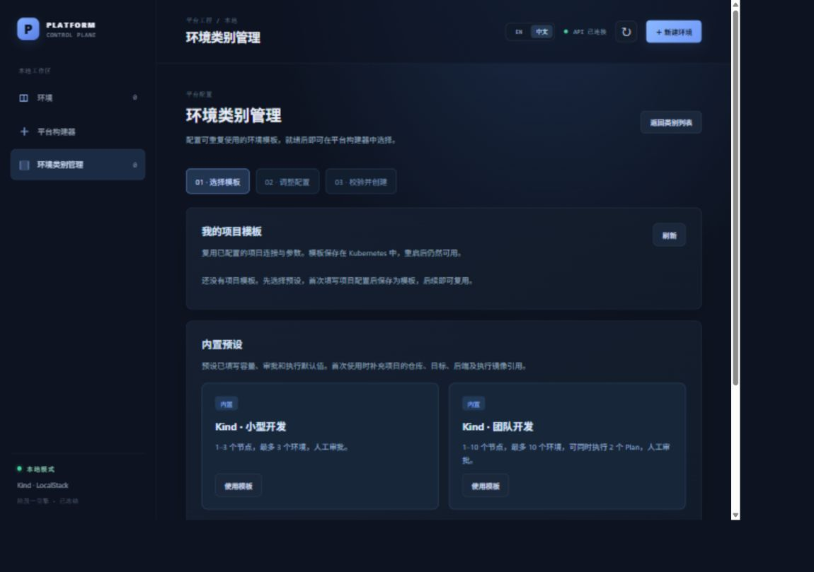

### 2. 三个概念要分清

| 页面概念 | 保存了什么 | 测试人员怎么使用 |
| --- | --- | --- |
| 内置预设 / Starter presets | 容量、审批、执行默认值；没有你项目的仓库、集群和镜像连接 | 首次创建时选一个，再补项目参数 |
| 项目模板 / Your saved templates | 首次填写后的完整配置快照，包括仓库、镜像、区域、高级参数和运行时 JSON | 后续选模板，只修改需要变化的字段；每份草稿各自独立 |
| 环境类别 / EnvironmentClass | 已保存到 Kubernetes、供创建环境选择的配置 | 必须达到 Ready 才能在构建器使用；调整时复制成新名称、新版本 |

**保存模板**只创建模板；**创建类别**只创建类别；这两个按钮都不会创建环境、执行 Terraform 或部署运行时资源。类别 Ready 表示配置被接收、控制器已处理；后端是否存在、镜像能否执行等，要在实际创建环境时检查。

### 3. 开发人员应先准备什么

测试人员优先在网页操作。以下是开发人员提供测试环境时应确认的条件。

| 项目 | 本轮使用值 / 要求 |
| --- | --- |
| 前端 | `http://127.0.0.1:5173`，Vite 将 `/api` 转发到 API |
| API | `http://127.0.0.1:8090/api/health` 返回 `status: ok` |
| 控制器 | 本机运行；`http://127.0.0.1:8081/readyz` 返回 `ok` |
| 管理集群 | Kind `pcp-dev`；上下文 `kind-pcp-dev`；节点 Ready |
| Kubeconfig | 本机 `tmp/kubeconfig-pcp-dev.yaml`；API 与控制器指向同一管理集群 |
| Kubernetes 能力 | 已安装项目 CRD；API 可读写 EnvironmentClass、读取 PlatformEnvironment；可在管理集群 `default` 命名空间读写模板 ConfigMap；控制器可更新类别状态和 finalizer |
| 本轮执行边界 | `PCP_ENABLE_AWS_EKS=false`、`PCP_ENABLE_TERRAFORM_EXECUTION=false`；只测类别与模板管理 |
| AI / LocalStack | 本文的管理用例不调用模型或基础设施执行；不需要为了填写类别而先生成 AI 草稿 |

服务停止时，请开发人员按 [README 的 Local console](../README.md#local-console)恢复 API、控制器和前端。不要将“API 已连接”当成控制器也正常的证明：API 可以保存类别，但控制器停机时类别会等待处理。

## 二、测试数据：哪些可以直接抄，哪些需要项目提供

### 1. 本文有两种测试目标

| 目标 | 参数要求 | 验证到哪里 |
| --- | --- | --- |
| **A：复现本文的类别和模板管理** | 可用下表的本轮数据；后端和服务账户名称仅作为引用，不需要执行 Terraform | 表单校验、保存、Ready、复用、构建器选项、删除 |
| **B：继续创建实际可用环境** | 必须由开发人员提供存在的后端 ConfigMap、服务账户、可运行且身份匹配的 Runner 镜像、可拉取的固定来源提交，以及完整本地执行配置 | 另执行环境 Plan → 审批 → Apply → Ready → Destroy；本文未重跑这一段 |

**本轮 `ui-e2e-backend` 是专用于目标 A 的引用名称，没有创建对应 ConfigMap。** 本轮也没有创建 `terraform-runner` 服务账户、状态桶或 Runner Job。用这套数据可以验证类别管理，但不能直接作为目标 B 的可部署模板。

真实项目第一次填参数应由开发人员提供；测试人员保存为项目模板后，后续主要改名称、版本、区域和容量。模板功能省掉的是重复输入项目连接信息。

### 2. 本轮完整输入数据

名称中的 `20261003-r1` 是本次独立测试标记。重新执行可改成当天日期和测试人标记，例如 `20261004-qa1`；**同一次测试中的类别名称、模板名称及删除确认必须一致**。

| 参数 | 本轮输入 |
| --- | --- |
| 原始类别名称 | `ui-class-small-20261003-r1` |
| 类别版本 | `v1` |
| 提供方 | `Kind`，保存值为 `kind` |
| 目标集群 / 上下文 | `kind-pcp-dev` |
| 账户 | `local` |
| 默认区域 | `local` |
| 可选区域 | `local, local-secondary`，使用英文逗号 |
| 基础设施仓库地址 | `https://github.com/miku-wwl/kube-platform-control-plane.git` |
| 固定来源提交版本 | `814d245fa00ecad8bad0f71a9844f55b25a54605` |
| Terraform 目录 | `test/fixtures/terraform/localstack-basic` |
| 后端配置名称 | `ui-e2e-backend`，仅引用，不是本轮创建的后端 |
| Runner 服务账户 | `terraform-runner`，仅引用，不是本轮创建的账户 |
| Runner 镜像 | `platform-terraform-runner:local-20261002113306-53dc5e11` |
| Runner 镜像摘要 / 本地标识 | `sha256:8a0eb44312d04ff3b05c7e44cc42401a8f790121a6fd757d9dc6fc9bbd1951c8` |
| Terraform 版本 | `1.14.0` |
| 执行超时 | `12m` |
| 最少 / 最多节点数量 | `1` / `3` |
| 环境数量上限 | `3` |
| 同时 Plan / Apply 数量上限 | `1` / `1` |
| 审批策略 | `人工审批`，保存值为 `Manual` |
| 锁等待超时 / 执行器工作目录 | `2m` / `/workspace/terraform` |
| Terraform 并行数量 | `2`，用于检查高级参数复用；普通测试可以留空 |
| 运行系统 / 运行架构 | `linux` / `amd64`，用于检查保存和复用 |
| 运行时资源 JSON | 基础路径用 `[]`；完整复现本轮保留性测试用第三节的 ConfigMap JSON |
| 其余高级参数 | 留空 |
| 模板名称 | `ui-project-20261003-r1` |
| 模板显示名称 | `网页验收 · 小型开发` |
| 模板说明 | `首次配置后复用仓库、镜像、区域和运行时参数` |

`local-secondary` 是为了验证下拉选项而填写的本地标签，不代表第二个真实地区或集群。Runner 镜像来自本机先前已有构建；上表的 `sha256` 是本地 Docker **Image ID**，不是镜像仓库的 manifest digest。本轮没有运行该镜像或验证其拉取、导入 Kind 的执行路径。

## 三、表单每一个参数怎么填

页面星号表示必填。没有星号的字段也可能有默认值和后端约束，例如锁等待超时不能清空、执行器工作目录不能清空。先保留预设默认值，再修改明确需要调整的参数。

### 01 · 名称与目标 / Identity and target

| 中文字段（英文） | 怎么填 | 从哪里取得 / 注意点 |
| --- | --- | --- |
| 类别名称（Class name）* | `ui-class-small-20261003-r1` | 测试人员取唯一小写名称；推荐只用字母、数字、短横线，以字母或数字开头结尾。类别是集群级对象，不能依靠换命名空间避开重名 |
| 版本（Version）* | `v1`；下一份可用 `v2` | 这是类别配置版本，**不是 Git 提交版本**。只改版本不能覆盖同名类别，还要取新的类别名称 |
| 提供方（Provider） | 本地选 `Kind` | 本轮不选择 AWS EKS；切换 AWS 会显示额外 ARN 字段 |
| 目标集群 / 上下文（Target cluster / context）* | `kind-pcp-dev` | 开发人员提供控制器已配置的 kubeconfig 上下文。不是 Docker 容器名 `pcp-dev-control-plane`，也不是仓库目录名 |
| 账户（Account）* | 本地填 `local` | 真实 AWS 配置须由管理员提供账户身份；本文不验证云上执行 |
| 默认区域（Default region）* | `local` | 本地标识。改成 `local-secondary` 时，可选区域里也必须包含它 |
| 可选区域（Allowed regions） | `local, local-secondary` | 用**英文逗号**分隔，不能重复；包含默认区域。留空表示类别不限制区域，但构建器不会因此自动枚举所有区域 |

### 02 · 基础设施来源 / Infrastructure source

| 中文字段（英文） | 怎么填 | 从哪里取得 / 注意点 |
| --- | --- | --- |
| 基础设施仓库地址（Source repository URL）* | 上表的 HTTPS Git URL | 开发人员提供 Terraform 来源仓库；不能填本机 `D:\...` 路径，也不能把口令或 token 拼到 URL 内 |
| 固定来源提交版本（Pinned source commit）* | 完整 40–64 位十六进制提交哈希 | 开发人员从来源仓库取得；不填 `main`、标签名或 `814d245` 这类短哈希。类别校验不等于仓库已实际拉取 |
| Terraform 目录（Terraform directory）* | `test/fixtures/terraform/localstack-basic` | 相对来源仓库根目录；仓库根目录填 `.`。使用 `/`，不填绝对路径、反斜线或 `../` |

### 03 · 后端与执行器 / Backend and runner

| 中文字段（英文） | 怎么填 | 从哪里取得 / 注意点 |
| --- | --- | --- |
| 后端配置名称（Backend configuration name）* | 管理测试填 `ui-e2e-backend` | 填 **ConfigMap 名称**，不是桶名称、文件路径、`backend.hcl` 文件内容。实际执行前，对应环境命名空间中必须有包含 `backend.hcl` 的 ConfigMap；由开发人员准备 |
| Runner 服务账户（Runner service account）* | `terraform-runner` | 填 Kubernetes ServiceAccount 名称，不是 kubeconfig 用户名。页面会同步后端与 Runner 的账户引用；实际执行前须存在并具备所需权限 |
| Runner 镜像（Runner image）* | 上表镜像引用 | 开发人员提供项目 Terraform Runner 镜像，不能随便换成只有 Terraform CLI、没有项目执行入口的镜像 |
| Runner 镜像摘要 / 本地标识（Runner image digest / local identity）* | 上表完整 `sha256:...` | 必须与所用镜像匹配。发布镜像使用固定镜像摘要；本地开发可以使用本地镜像身份。填了某个字符串并通过类别校验，不代表它已与实际 Pod 镜像核对 |
| Terraform 版本（Terraform version）* | `1.14.0` | 与 Runner 内实际版本一致。页面同步执行器及 Runner 的版本字段；不能只改这个字符串就认为镜像已升级 |
| 执行超时（Execution timeout）* | `12m`，也可以 `1h` | 时间长度包含单位；不填 `12`、`12分钟` 或 `0m`。保持预设即可 |

### 04 · 容量与策略 / Regions, capacity and policy

| 字段 | 小型预设 | 团队预设 | 填写规则 |
| --- | --- | --- | --- |
| 最少节点数量（Minimum nodes） | 1 | 1 | 非负整数；不得超过大于 0 的最多节点数量 |
| 最多节点数量（Maximum nodes） | 3 | 10 | 非负整数；0 表示类别不单独限制 |
| 环境数量上限（Environment limit） | 3 | 10 | 该类别的环境数量上限；0 表示类别不单独限制 |
| 同时 Plan 数量上限（Concurrent plan limit） | 1 | 2 | 非负整数；类别并发仍受控制器总并发限制 |
| 同时 Apply 数量上限（Concurrent apply limit） | 1 | 1 | 非负整数；类别并发仍受控制器总并发限制 |
| 审批策略（Approval policy） | 人工审批 | 人工审批 | 本轮保留 Manual。Automatic 是另一项执行策略，不是免校验保存开关，未在本轮执行验证 |

这里定义的是**允许范围和策略**。类别的最多节点数改成 5，不会立即扩容某个集群或修改已有环境的节点数。本轮不验证容量限制下的并发负载执行。

### 高级执行与运行时配置 / Advanced execution and runtime settings

初次基础测试只保留默认的锁等待超时、工作目录和 `[]`，其余可留空。完整复现本轮测试时，加 `parallelism=2`、`linux`、`amd64` 和下面的安全 JSON。

| 中文字段（英文 / 配置键） | 本轮值 | 填写说明 |
| --- | --- | --- |
| 锁等待超时（Lock timeout） | `2m` | 等待 Terraform 状态锁的时长，必须为正；保留默认，不能填 `0m` |
| 执行器工作目录（Executor working directory） | `/workspace/terraform` | **Runner 容器内**工作目录；不是 Windows 仓库路径，保留默认 |
| Terraform 并行数量（Terraform parallelism） | `2` | 可留空；指定时为正整数，不能填 0。本轮验证保存和复用，不证明执行时同时运行了两个任务 |
| 运行系统（runtimeOS） | `linux` | 可留空；由开发人员按执行器平台提供。本轮只检查值保留 |
| 运行架构（runtimeArchitecture） | `amd64` | 可留空；由开发人员提供，与镜像平台相关。本轮只检查值保留 |
| 集群标识（clusterID） | 留空 | Kind 未指定时，后续目标物化使用集群名称作为默认标识；自定义值由管理员提供 |
| 集群实例标识（incarnationID） | 留空 | 未指定时从集群标识或集群名称取默认值；不是测试人员随手填的随机编号 |
| 连接配置引用（connectionProfileRef） | 留空 | 本地 Kind 可默认为 `kubeconfig:kind-pcp-dev`；自定义连接由管理员提供。不是 kubeconfig 文件全文 |
| 管理角色 ARN（Management role ARN） | 留空 | 与管理侧 Runner 身份相关；Kind 基础测试不填，云上值及权限由管理员提供 |
| Valkey 镜像（valkeyImage） | 留空 | 可选配置，本轮未启用缓存，也未验证部署；仅填写它不会自动生成 Valkey 资源 |
| Operator 镜像（operatorImage） | 留空 | 可选配置，本轮未验证 Operator 部署 |
| Operator 镜像摘要（operatorImageDigest） | 留空 | 若项目使用 Operator，由开发人员提供匹配摘要；本轮未验证 |
| Operator 清单引用（operatorManifestRef） | 留空 | 按项目约定提供清单引用，不能直接粘贴 YAML；本轮未验证引用解析 |
| 网络策略配置（networkPolicyProfile） | 留空 | 按项目约定提供配置；填字符串不等于网络策略已经部署 |
| 数据保留策略（Data retention policy） | 留空 | 不要猜 `Delete`、`Retain` 等值。目前该字段保存于配置，源码没有相应删除策略执行逻辑；不能用它证明数据保留行为 |
| 运行时资源（JSON，可选） | `[]` 或下方数组 | 必须是 JSON **数组**，每项包含资源定位和 `object` 清单；不是一个裸 Kubernetes 对象，也不是 YAML。不能放内嵌 Secret 或口令 |

Valkey、Operator、网络策略这些字段当前可保存到配置，但当前控制器没有凭这些字段自动生成对应资源的路径。需要验证实际运行时资源时，应使用项目已经支持的 `runtimeObjects` 路径，并另做环境生命周期测试。

**运行时 JSON 的保留性测试数据：**

```json
[
  {
    "version": "v1",
    "resource": "configmaps",
    "object": {
      "apiVersion": "v1",
      "kind": "ConfigMap",
      "metadata": {
        "name": "ui-template-marker",
        "namespace": "default"
      },
      "data": {
        "purpose": "class-template-ui-e2e"
      }
    }
  }
]
```

这段 JSON 用来证明模板能完整保存、复用可选资源。类别保存和 Ready 后，实际集群中**不应出现** `ui-template-marker` ConfigMap；本轮已核对不存在。`resource` 用 Kubernetes 复数资源名 `configmaps`，不要填单数 `ConfigMap`。基础流程可保持 `[]`。

### 选择 AWS EKS 时额外出现的字段

| 字段 | 如何填写 |
| --- | --- |
| 集群 ARN（clusterARN） | 管理员提供目标集群身份；本轮 Kind 测试不填 |
| 基础设施执行角色 ARN（executionRoleARN） | 管理员提供基础设施执行身份；不是运行时访问角色 |
| 运行时访问角色 ARN（runtimeRoleARN） | 管理员提供访问目标运行时的身份 |

这些是页面提供的其他参数，**不属于本轮验证范围**。本文没有启用 AWS EKS、访问真实 AWS 或验证这些身份的权限。

### 保存模板时的三个参数

| 字段 | 本轮值 | 规则 |
| --- | --- | --- |
| 模板名称（Template name） | `ui-project-20261003-r1` | 唯一机器名称，最多 63 字符；小写字母、数字、短横线，字母或数字开头结尾。删除确认输入这一项 |
| 模板显示名称（Template title） | `网页验收 · 小型开发` | 人可读标题，可以中文；必填且最多 120 **字节**，中文占用多个字节。它不是删除确认名称 |
| 模板说明（Description, optional） | 上表说明 | 可留空，最多 1000 **字节**；简短说明模板用途 |

同名模板不会被覆盖。当前页面没有“原地编辑模板”：需要更新模板时，使用原模板调整草稿、重新校验，再以新的模板名称保存；确认新模板可用后再删除旧模板。

### 开发人员如何取得真实项目参数（只读命令）

这些命令用来查值，不是测试人员完成每个网页用例的必需步骤。应在**实际来源仓库**执行前两条命令，不要从其他仓库抄提交哈希。

```powershell
git remote get-url origin
git rev-parse HEAD
kubectl --kubeconfig tmp/kubeconfig-pcp-dev.yaml config get-contexts -o name
kubectl --kubeconfig tmp/kubeconfig-pcp-dev.yaml -n default get configmaps
kubectl --kubeconfig tmp/kubeconfig-pcp-dev.yaml -n default get serviceaccounts
docker image inspect platform-terraform-runner:local-20261002113306-53dc5e11 --format '{{.Id}}'
docker image inspect platform-terraform-runner:local-20261002113306-53dc5e11 --format '{{json .RepoDigests}}'
```

`default` 要换成准备创建环境的命名空间。`.Id` 查询本地 Image ID；`.RepoDigests` 查询镜像仓库身份，本地构建可能没有 RepoDigests。不要互换这两种值。名称查询只证明对象存在；实际执行所需权限、后端内容及镜像可运行性需另验。

## 四、测试用例设计

建议按顺序执行，用同一套后缀；CT-09、CT-10 最后清理。自动建议的名称可手动替换为本报告名称，方便对照和删除。

| 编号 | 场景 | 通过标准 | 本轮结果 |
| --- | --- | --- | --- |
| CT-01 | 入口、预设和空白表单 | 两个预设可用，默认值正确；空白必填项阻止提交 | PASS |
| CT-02 | 输入约束和重新校验 | 错误参数拒绝；校验不创建对象；修改后必须重新校验 | PASS |
| CT-03 | 保存项目模板 | 仅保存模板、草稿保留、重名不覆盖 | PASS |
| CT-04 | 类别创建和构建器选择 | Kubernetes 类别创建、控制器 Ready；类别及区域可选 | PASS |
| CT-05 | 模板复用和独立性 | 改 4 项可创建新类别，来源和高级参数保留，原配置不变 | PASS |
| CT-06 | 已有类别复用和中英文切换 | 自动建议新名称版本；语言切换保留草稿；新类别 Ready | PASS |
| CT-07 | 刷新与 API 重启持久化 | 已保存模板重新出现，API 重启前后模板 UID 相同 | PASS |
| CT-08 | 对象身份与删除保护 | 过期 UID 拒绝；引用保护有契约测试覆盖 | PASS（API / 单元范围，见用例） |
| CT-09 | 模板删除确认 | 机器名称精确匹配才可删；已创建类别保留 | PASS |
| CT-10 | 类别删除及测试清理 | 精确名称确认；finalizer 清理完成；测试对象归零 | PASS |

## 五、网页操作步骤与实际结果

### CT-01｜入口、内置预设、空白表单

**前提：** API 连接正常；没有同名测试数据。

1. 在左侧打开 **环境类别管理**，点 **创建类别**。
2. 在 **Kind · 团队开发**卡片点 **使用模板**，查看“容量与策略”：应为最少 1、最多 10、环境上限 10、Plan 上限 2、Apply 上限 1、人工审批。
3. 点 **重新选择模板（重置草稿）**，再选 **Kind · 小型开发**：对应值应为 `1 / 3 / 3 / 1 / 1 / 人工审批`。
4. 未校验前查看页面底部，**保存为模板**和**创建类别**应禁用。
5. 回到模板选择，点 **从空白表单开始**。清空类别名称，点 **校验配置**；浏览器应提示必填项，不能创建对象。
6. 点 **取消**回到列表，重新选小型预设，为 CT-02 填第三节数据。

**本轮：PASS。** 两种预设的节点上限分别为 10、3；未校验按钮禁用；空白必填项由浏览器拦截。

“空白表单”仍保留通用执行默认值，不是每个字段都空；“重新选择模板”会重置未保存草稿，语言切换不会。

### CT-02｜参数校验、错误提示、校验结果失效

**前提：** 小型预设已填完整第三节数据；每次负例只改一项，测完恢复正确值。

| 测试输入 | 网页操作 | 预期结果 |
| --- | --- | --- |
| 固定来源提交版本改为 `main` | 点校验配置 | 拒绝，提示 `source.revision` 需要固定完整提交哈希；创建按钮禁用 |
| 默认区域 `local`，可选区域只填 `local-secondary` | 点校验配置 | 拒绝，提示默认区域必须包含在可选区域中 |
| 最少节点 `4`，最多节点 `3` | 点校验配置 | 拒绝，提示最小节点数不能超过最大节点数 |
| 运行时 JSON 改为 `{}` | 展开高级配置，点校验 | 拒绝，要求资源定义数组 |
| 放入内嵌 Secret | 用下方无真实凭据的负例，点校验 | 拒绝内嵌 Secret / 凭据；不保存 |
| 全部恢复正确值 | 点校验配置 | 显示 **配置校验通过**，可展开清单查看 YAML；保存模板和创建类别启用 |
| 校验通过后版本改为 `v1-edited` | 直接观察按钮 | 旧校验失效，创建按钮再次禁用；恢复 `v1` 后也须重新点校验 |

Secret 负例仅使用虚构测试字符串，不输入实际凭据：

```json
[{"version":"v1","resource":"secrets","object":{"apiVersion":"v1","kind":"Secret","metadata":{"name":"ui-rejected-secret"},"stringData":{"password":"ui-test-only"}}}]
```

**开发人员辅助核对：** 校验通过之后、点保存之前，集群不应新增该类别、PlatformEnvironment 或 TerraformRun。页面的校验是实际 Kubernetes dry-run，不是创建成功。

**本轮：PASS。** 上述负例均被拒绝；正确配置通过真实准入；修改配置使旧结果失效；校验阶段没有创建类别、环境或执行对象。

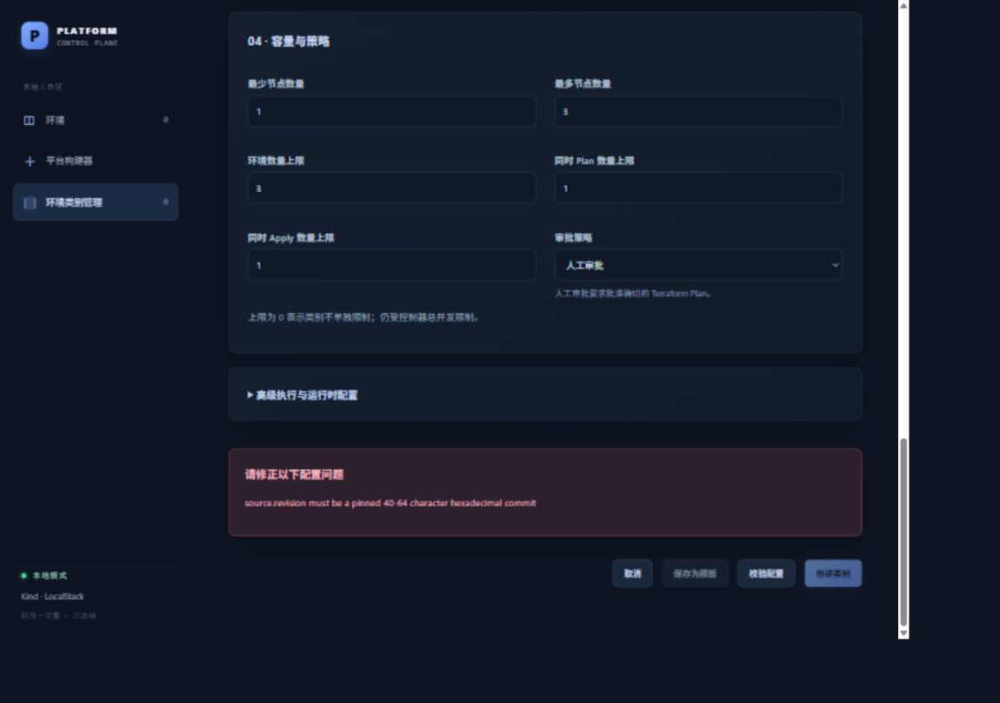

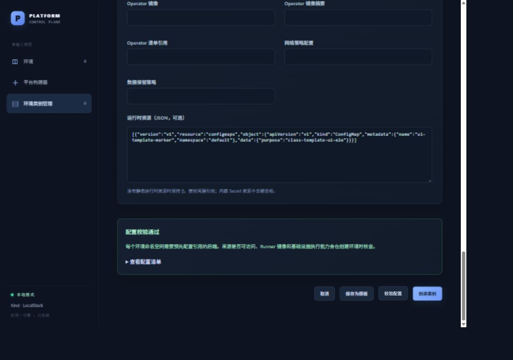

### CT-03｜保存项目模板，重名不覆盖

**前提：** CT-02 正确配置重新校验通过，类别尚未创建。

1. 点页面底部 **保存为模板**。
2. 填模板名称 `ui-project-20261003-r1`、显示名称 `网页验收 · 小型开发`、第三节的说明。
3. 点新出现的小面板内 **保存模板**。不要误点底部的 **创建类别**。
4. 预期显示 **模板已保存**，原类别草稿仍在；类别列表尚未增加、环境数仍为 0。
5. 再点 **保存为模板**，输入**相同模板名称**，显示名称改成 `重复名称不应覆盖原模板`，点保存。
6. 预期出现重名错误；原模板标题与配置不变。取消这个保存面板，保留类别草稿继续 CT-04。

**开发人员辅助核对：** 模板对应管理集群 `default/pcp-class-template-ui-project-20261003-r1`，内容键 `template.json`；此时 EnvironmentClass、PlatformEnvironment、TerraformRun 仍不存在。

**本轮：PASS。** 保存模板后只出现模板 ConfigMap，未触发类别或基础设施创建。重名保存拒绝，原标题未被覆盖。

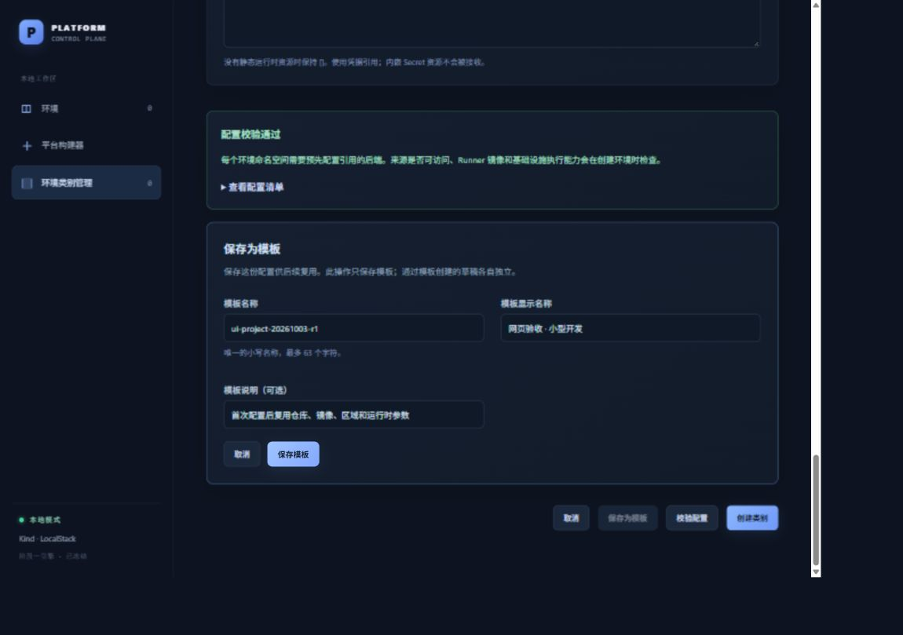

### CT-04｜创建类别、等待就绪、选择区域

**前提：** CT-03 的原始草稿仍在且校验有效；如修改过字段，重新校验。

1. 点 **创建类别**，进入 `ui-class-small-20261003-r1` 详情。
2. 初始可能显示等待；页面每 8 秒刷新一次。预期控制器状态变为 **Ready: 是 · ClassValidated**，顶部显示 **就绪**，**使用此类别**可点。
3. 点 **查看配置清单**，对照名称、v1、两项可选区域、source、backend、runner 和 runtimeObjects。
4. 点 **使用此类别**，进入 **平台构建器**；预期类别已自动选为刚创建的类别。
5. 打开 **区域**下拉框：应有 `使用类别默认值 (local)`、`local`、`local-secondary`；选择 `local-secondary`，控件显示所选值。
6. 本文的构建器用例到“类别/区域可选”为止。不要用管理测试的后端引用继续提交实际环境。
7. 从左侧回到类别管理，核对原类别仍为 v1、默认区域 local、节点范围 1–3。

**本轮：PASS。** 真正创建了 Kubernetes 类别；控制器报告 Ready，`observedGeneration` 等于 `generation=1`，存在类别 finalizer；构建器自动选择类别，第二个区域可选。仍无 PlatformEnvironment / TerraformRun。

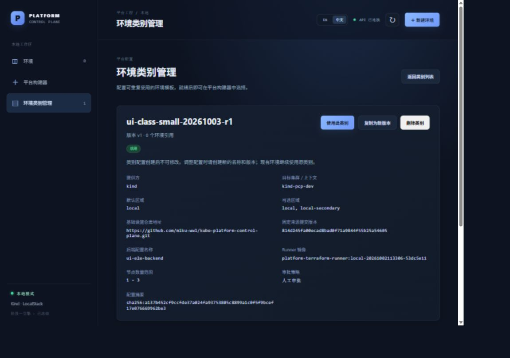

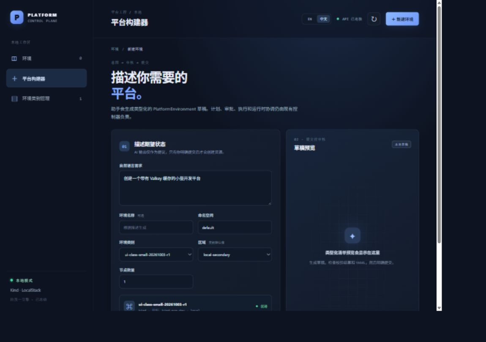

### CT-05｜从项目模板出发，只修改少量参数

**前提：** 原类别和项目模板已存在。

1. 类别管理 → **创建类别**，在 **我的项目模板**找到 `网页验收 · 小型开发`，点其 **使用模板**。
2. 预期仓库、后端、Runner 等自动填入；“基础设施来源”“后端与执行器”默认折叠，展开后能看到原值。
3. 只修改下面四项：

   | 字段 | 原值 | 新值 |
   | --- | --- | --- |
   | 类别名称 | 自动建议值 | `ui-class-copy-20261003-r1` |
   | 版本 | `v1` | `v2` |
   | 默认区域 | `local` | `local-secondary` |
   | 最多节点数量 | `3` | `5` |

4. 可选区域保留 `local, local-secondary`。展开高级配置，核对 parallelism=2、linux、amd64、运行时 JSON 与模板一致。
5. 负例：暂时把类别名称改成已存在的 `ui-class-small-20261003-r1`，点校验；应拒绝同名创建。
6. 恢复新名称，再点 **校验配置 → 创建类别**，等待新类别 Ready。
7. 返回列表打开原类别，仍应为 **v1 / local / 最大 3**；新类别是 **v2 / local-secondary / 最大 5**。
8. 再次选原项目模板，仍应得到 **v1 / local / 最大 3**。取消这份核对草稿即可。

**本轮：PASS。** 改四项创建第二个 Ready 类别；来源、Runner、高级执行参数和 runtimeObjects 均保留；API 核对原类别、原模板没有变化。复用是一份新配置，保存时不会修改来源对象。

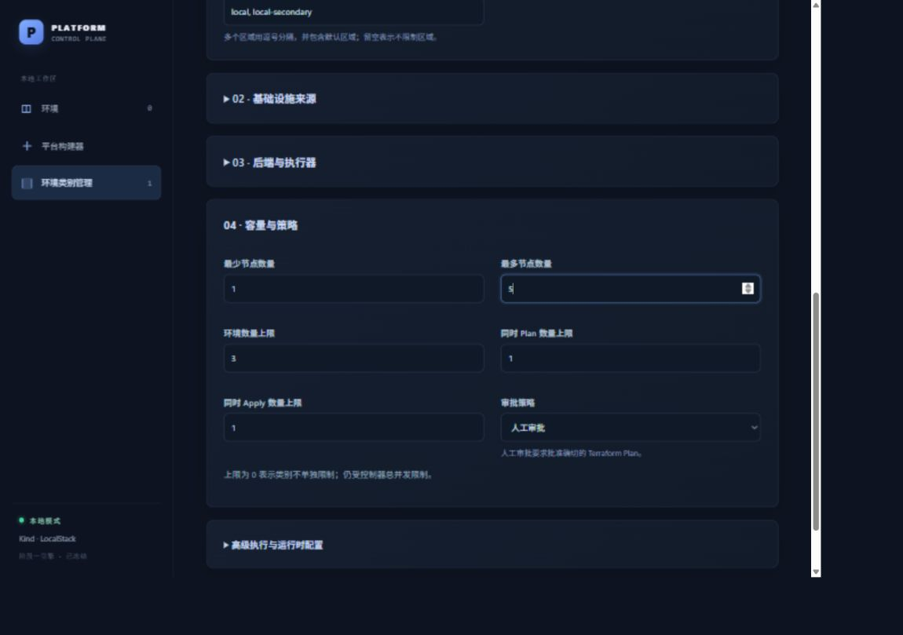

### CT-06｜已有类别复用、复制新版本、中英文

**前提：** CT-05 的第二个类别存在。

1. 类别管理 → 创建类别 → **从已有类别创建**，找到 `ui-class-copy-20261003-r1`，点 **作为模板使用**。
2. 预期建议新名称 `ui-class-copy-20261003-r1-next`、新版本 `v2-next`；区域 local-secondary、最多节点 5 保留。若建议名称已存在，页面会加后缀；不要覆盖原类别。
3. 点右上角 **EN**。预期按钮、表单变英文，已填名称、版本和容量不丢失。再切回中文。
4. 校验并创建第三个类别，等待 Ready。
5. 在第三个类别详情点 **复制为新版本**，应出现另一份新草稿，建议名称带新的 `-next`，版本也是新版本；原第三个类别不变。
6. 点 **取消**，不保存第四个类别。

**本轮：PASS。** 从已有类别实际创建第三个 Ready 类别；语言切换保留草稿；详情复制入口产生独立草稿，并已取消。本轮最终只创建三个类别。

### CT-07｜刷新及 API 重启后仍可复用

**前提：** 项目模板已保存，尚未删除。浏览器刷新会丢弃未保存草稿，所以先取消或保存草稿。

1. 在模板选择页刷新浏览器，再打开 **我的项目模板**。
2. 预期模板仍存在；使用后仓库固定提交、运行时 JSON、高级参数仍在。
3. **开发人员协助步骤：** 记录该模板 ConfigMap UID，重启当前项目的 API 进程，保留 Kind 集群及 ConfigMap。不要停止或删除集群。
4. 等 API 恢复连接，刷新网页，重新进入模板选择。
5. 预期模板仍存在且可复用；开发人员查询重启后 UID，必须与之前相同。

**本轮：PASS。** 实际停止并重新启动本轮 API 二进制，页面重新读取成功。模板 UID 前后均为 `f6375a53-a2b4-4327-8023-560a3cca7964`。因此不是浏览器内存或一次草稿的保留。

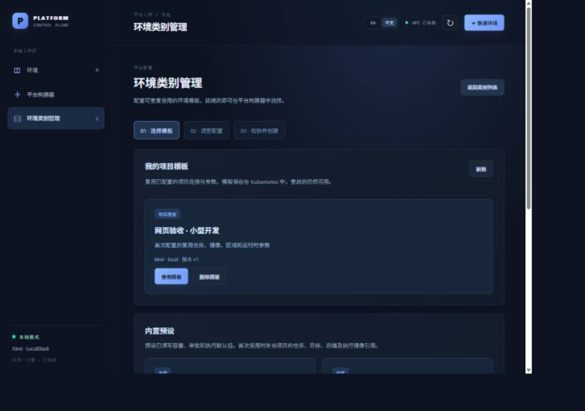

### CT-08｜身份检查与被引用类别保护

这项有辅助 API 和单元测试，不应仅凭网页截图宣称全部实测。

| 检查项 | 手动 / 辅助方法 | 本轮结果与证据范围 |
| --- | --- | --- |
| 过期模板 UID | 开发人员向模板 DELETE 端点提供精确名称，但 UID 换成不匹配的测试 UID | 真实 API 返回 409，模板保留；之后网页正常删除使用真实 UID |
| 过期类别 UID | 同样向类别 DELETE 端点提供错误 UID | 真实 API 返回 409，类别保留 |
| 正在被环境引用的类别 | 有现成、可控的测试环境时，打开其引用的类别，核对引用数与删除禁用；不可删除用户现有类别 | **本轮没有创建引用环境，未执行这个网页分支**；`TestClassDeletionChecksFreshUsageAndUID` 与 `TestClassFinalizerProtectsUsageAndReleasesAfterEnvironmentRemoval` 的现有契约测试通过 |

本轮实测的是 0 引用类别的网页删除及真实 finalizer 完成。引用保护的单元通过不能替代一个实际部署环境的引用删除 E2E。

### CT-09｜删除项目模板，已有类别保留

**前提：** 三个测试类别均 Ready；项目模板存在。只处理本文名称的测试数据。

1. 在模板选择页，找到测试模板，点 **删除模板**。
2. 在 **输入模板名称以确认**填显示标题 `网页验收 · 小型开发`；删除按钮必须禁用。
3. 改填机器名称 `ui-project-20261003-r1`；删除按钮才能启用。
4. 点确认面板内 **删除模板**，预期模板卡片消失。
5. 返回类别列表，三个类别必须仍存在且 Ready；打开第二个类别，仓库、镜像、区域及容量保持不变。

**本轮：PASS。** 显示标题不能确认删除；精确机器名称可删；模板 ConfigMap 消失，三个已创建类别保留。没有引用环境，故本轮未验证已有环境在模板删除后的运行状态。

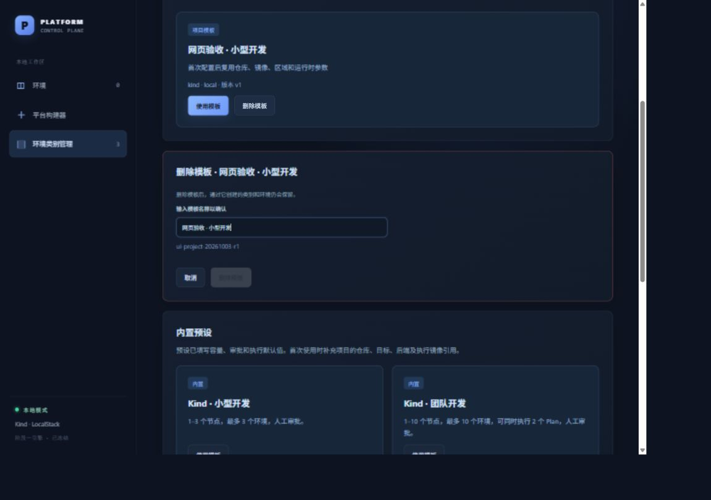

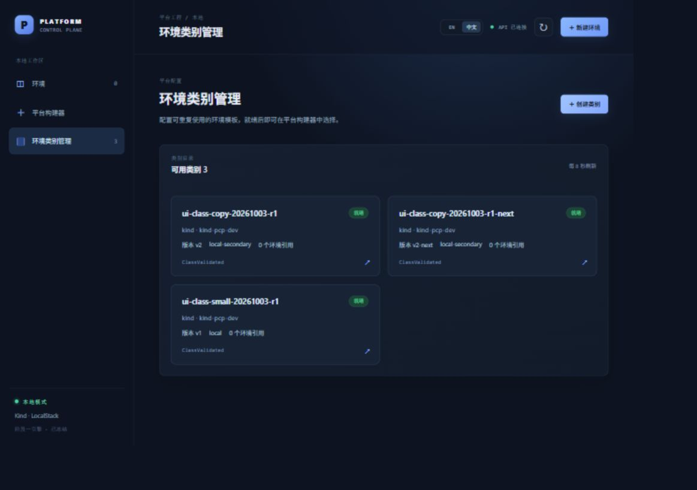

### CT-10｜类别删除确认和清理

**前提：** CT-09 模板已删除；三类引用数均为 0。按第三个 → 第二个 → 原始类别清理。

1. 打开 `ui-class-copy-20261003-r1-next`，点 **删除类别**。
2. 输入不完整名称，例如 `ui-class-copy-20261003-r1`；确认删除必须禁用。
3. 输入完整 `ui-class-copy-20261003-r1-next`，再点确认删除。
4. 等控制器完成删除，返回列表应剩 2 个类别。请求成功后可能短暂显示“删除中”，最终消失才算完成。
5. 重复清理 `ui-class-copy-20261003-r1`、`ui-class-small-20261003-r1`。
6. 最终显示 **可用类别 0 / 尚无环境类别**；模板选择页显示没有项目模板，内置预设仍在。
7. 开发人员按第七节只读核对：三个测试类别及模板 ConfigMap 不存在，未出现 PlatformEnvironment / TerraformRun / 运行时标记资源。

**本轮：PASS。** 三个类别均经网页名称确认删除，控制器释放 finalizer。API 类别和模板列表均返回 `[]`，Kubernetes 无测试类别、环境、TerraformRun、模板 ConfigMap；运行时 `ui-template-marker` 没有部署。本轮测试对象已清理，API、前端、控制器仍在运行，原有 Kind 与外部 LocalStack 保留。

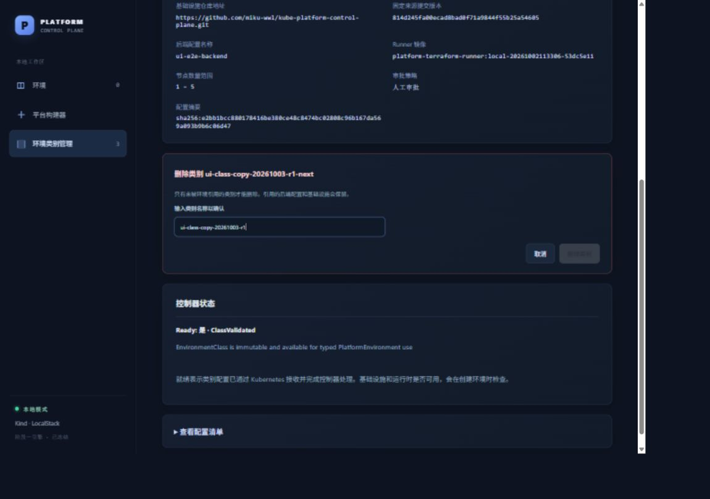

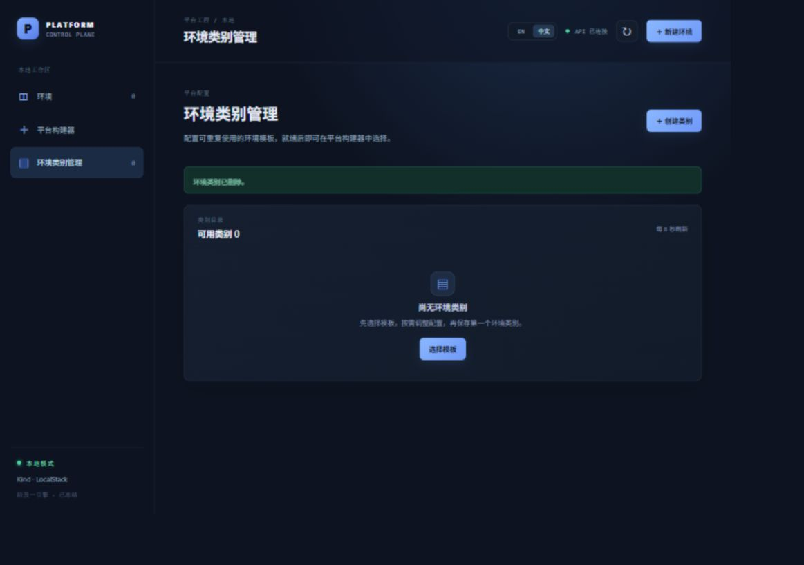

## 六、本轮实测记录、问题和质量检查

### 1. 真正创建并核对的对象

| 对象 | 关键身份与结果 | 最终状态 |
| --- | --- | --- |
| 项目模板 `ui-project-20261003-r1` | UID `f6375a53-a2b4-4327-8023-560a3cca7964`；ConfigMap 持久化；API 重启 UID 不变 | 网页删除完成 |
| 原类别 `ui-class-small-20261003-r1` | UID `769ef01d-03c5-49e8-a3cb-b980820c5032`；v1 / local / 最大 3；Ready | 网页删除完成 |
| 模板复用类别 `ui-class-copy-20261003-r1` | UID `fb8c4d9f-8aed-490d-994e-3cf864272d57`；v2 / local-secondary / 最大 5；Ready | 网页删除完成 |
| 已有类别复制 `ui-class-copy-20261003-r1-next` | v2-next / local-secondary / 最大 5；Ready | 网页删除完成 |
| 运行时标记 `ui-template-marker` | 仅保存在 spec 的 runtimeObjects 里 | 未创建实际 ConfigMap |
| PlatformEnvironment / TerraformRun | 管理用例没有创建环境，也没有基础设施执行 | 始终不存在 |

### 2. 发现并修正的界面问题

| 问题 | 修正 | 复验结果 |
| --- | --- | --- |
| 构建器默认区域和显式 `local` 选项同名 | 默认项显示 `使用类别默认值 (local)`，与显式区域区分 | 实际下拉选项文字、选择第二个区域通过 |
| 类别已 Ready，但创建成功提示仍说“正在等待” | 改为“类别已保存，请查看下方控制器状态。” | 新创建类别的成功提示与 Ready 状态一致 |

**开发期间的另一个观察：** 修改翻译源文件时，Vite 热更新曾出现 `useI18n must be used inside LanguageProvider`，页面空白；正常刷新恢复，Kubernetes 中已保存的数据未丢失。普通页面刷新、中英文切换用例通过。本次没有改动热更新机制，也没有把这次开发期异常记为正常成功。

### 3. 运行版本及检查

| 检查项 | 本轮执行方式 | 结果 |
| --- | --- | --- |
| 实际页面 E2E | 浏览器填写、点击、选择、刷新；40 项结果断言；12 张截图 | PASS |
| 实际对象核对 | API + kubectl 查询保存对象、Ready、UID、配置差异、finalizer 删除和清理 | PASS |
| API / 控制器构建与运行 | 从 `814d245...` 源码构建 `platform-api-class-ui-e2e.exe`、`controller-class-ui-e2e.exe` 并运行，随后实测重启 API | PASS；构建时 backend 源码无差异，`vcs.modified=true` 来自已生成的未跟踪截图 |
| Go 测试 | `go test -count=1 ./...`，最终再次执行，含现有类别及引用保护测试 | PASS，退出 0 |
| Go 静态检查 | `go vet ./...` | PASS，退出 0 |
| 前端构建 | 两处界面修正后执行 `npm --prefix web run build`，包含 TypeScript 检查与 Vite 构建 | PASS，退出 0 |
| 文档及差异 | 本报告、原报告与 README 的本地链接及截图文件检查；`git diff --check` | PASS，链接目标均存在，差异检查退出 0 |
| 前端单元测试 / race / 完整第一阶段脚本 | 本轮没有运行；浏览器断言不是前端单元测试 | NOT RUN |
| Terraform / AI / 真正环境部署 | 未发起 Plan、Apply、Destroy 或 AI 草稿调用 | NOT VERIFIED |

本轮 API / 控制器使用当前源码新构建；前端为相同提交加上述三处文本修改，经 Vite 页面实际复验。Runner 镜像没有本轮重新构建、导入或运行，不能据此声称 Pod 运行身份已验证。

**证据说明：** 本文截图直接取自浏览器，未使用模拟界面。入口图在清理后补采，状态与初始空模板页相同；第 04 图展示模板填写面板，保存成功依据页面断言及 Kubernetes 对象；第 08 图主要展示容量和折叠的来源设置，名称、版本、区域的结果另由详情及 API 对照核实。

## 七、测试人员遇到问题怎么定位

| 现象 | 先检查什么 |
| --- | --- |
| 环境类别/区域下拉没有值 | 类别是否存在且 Ready；模板本身不会变成可选类别。类别列表为 0 时先创建类别。区域来自所选类别的 allowedRegions，不是系统自动发现 |
| 页面显示 API 断开 | 先确认 8090 API 和 5173 前端在运行，再刷新；不要为了修连接去改类别参数 |
| 校验后创建按钮仍灰 | 必填项、错误区是否仍有问题；是否校验后又改过任意参数。改回原值也要再校验 |
| `source.revision` 报错 | 必须完整提交哈希，不能是 main、标签或短哈希 |
| 默认区域报错 | 将默认区域加入可选区域；修改默认区域不会自动修改可选区域文本 |
| JSON 报错 | 保持 `[]` 先走通；有资源时用数组，包含 version、resource、object；不是 YAML；不能嵌入 Secret |
| 类别一直等待处理 | API 可用不代表控制器正常；核对控制器 readyz、日志和同一 kubeconfig。通常下一次约 8 秒刷新可看到变化；30 秒后仍不收敛应检查，而非伪造 Ready |
| 类别/模板名称重复，409 | 换唯一名称；模板不覆盖，类别也不覆盖。新版本还要有新名称 |
| 保存模板之后列表没有类别 | 这是两步操作；保存模板不等于创建类别，还要校验并创建类别 |
| 模板删除确认灰色 | 输入提示的机器名称，不能输入中文显示名称；必须完整匹配 |
| 类别删除按钮灰色 | 查看引用数、是否删除中；有环境引用的类别须先完成该测试环境的正常删除。不要手动移除 finalizer |
| 类别 Ready，但实际创建环境失败 | Ready 不验证后端引用存在或 Runner 可运行；不能将 `ui-e2e-backend` 这类管理测试引用当成已准备好的执行配置 |
| 高级镜像/网络策略填了却没有部署 | 这些字符串不会自动生成资源；按当前支持的 runtimeObjects 与环境生命周期路径验证 |
| 开发人员改翻译后 Vite 页面空白 | 本轮开发热更新曾出现该问题；刷新一次恢复。若普通操作也复现，记录控制台错误，另报缺陷 |

### 开发人员辅助核对命令

这些都是只读查询；测试人员提交问题时提供页面截图、类别/模板名称、发生时间及输入值即可，不应上传实际凭据。

```powershell
Invoke-RestMethod http://127.0.0.1:8090/api/health
Invoke-RestMethod http://127.0.0.1:8090/api/classes
Invoke-RestMethod http://127.0.0.1:8090/api/class-templates
kubectl --kubeconfig tmp/kubeconfig-pcp-dev.yaml get environmentclasses
kubectl --kubeconfig tmp/kubeconfig-pcp-dev.yaml get platformenvironments,terraformruns -A
kubectl --kubeconfig tmp/kubeconfig-pcp-dev.yaml -n default get configmap -l platform.example.io/configuration-kind=class-template
kubectl --kubeconfig tmp/kubeconfig-pcp-dev.yaml -n default get configmap ui-template-marker --ignore-not-found
```

删除前需要查单个类别，可用 `kubectl ... get environmentclass <类别名称> -o yaml`；模板 UID 用 `kubectl ... -n default get configmap pcp-class-template-<模板名称> -o jsonpath='{.metadata.uid}'`。模板存储命名空间固定为管理集群 default；它与某个将来环境使用的后端命名空间是不同概念。

## 八、验收范围与后续完整环境测试

**本轮通过的是类别与模板管理的本地 E2E：网页 → API → 真实 Kubernetes 存储 → 控制器 Ready / finalizer → 网页反馈。** 保存、复用、隔离、刷新、API 重启和删除均已实际执行。

下列项目没有在本轮验收：

- AI 实时草稿、完整环境创建、精确 Plan 审批、Apply、运行时 Ready、更新和 Destroy；原报告的历史结论不能当成本轮又执行了一次。
- 有实际 PlatformEnvironment 引用时的网页删除保护分支；本轮只运行现有 API / 控制器契约测试。
- Runner 实际 Pod、镜像拉取与身份、后端配置访问、状态桶、并发负载、真实集群扩容、Valkey / Operator / 网络策略实际部署。
- Kind 集群重建或删除后的模板恢复。模板保存在 Kubernetes；API 重启保留不等于删除集群后还能恢复。
- 第二浏览器复用、真实 AWS、生产部署与第三阶段。

若要继续验证“模板创建的类别能否部署实际环境”，由开发人员提供完整可执行的本地模板。也可按 [README 的 Stage 2 session](../README.md)使用现有 `e2e/Run-Stage1E2E.ps1 -Suite all -Stage2Session` 准备受控环境，再从该环境已有类别保存项目模板，执行[原第二阶段报告](第二阶段本地端到端验收报告.md)中的生命周期用例。**不要直接使用本文引用型后端数据跳过执行准备。**

本轮完成时应用保持启动；类别和模板测试数据已清理。测试人员可从第一节重新开始，首次补项目连接后保存模板，后续按 CT-05 只改所需参数。
