# 第二阶段本地端到端验收报告

**验收时间：** 2026 年 9 月 29—30 日（新西兰时间）\
**验收对象：** 平台控制台的环境创建、变更、删除，以及第一阶段能力回归\
**测试环境：** 浏览器中的平台控制台、Kind 集群、LocalStack、Foundry Local\
**代码版本：** `5e7e1a3`；控制器和 Terraform 执行器由当前源码重新构建

## 一、测试用例设计

| 编号 | 用户要完成的事 | 操作与检查点 | 通过标准 |
| --- | --- | --- | --- |
| TC-01 | 用自然语言准备环境 | 在构建器输入“小型开发环境”需求，生成并查看草稿；在明确提交前检查集群 | 页面显示可检查的草稿；未提交时集群中没有新环境 |
| TC-02 | 审核创建计划后部署 | 提交草稿，查看架构变化；审批前检查执行记录和模拟云资源；从页面批准计划 | 审批前没有 Apply 和存储资源；审批绑定当前计划；审批后基础设施、运行时和资源清单均就绪 |
| TC-03 | 修改容量 | 在页面把节点数从 1 改成 2，观察新一代计划与终态 | 新计划为 `NoChange`，环境重新就绪；原运行时对象身份不变，存储资源保留 |
| TC-04 | 安全删除环境 | 点击删除，先验证名称确认；提交删除后查看销毁计划并单独审批 | 运行时资源被裁剪；销毁计划只包含预期删除；批准对应计划后环境、运行时对象和模拟云资源均消失 |
| TC-05 | 核对生命周期记录 | 查看 Terraform 执行记录和生命周期时间线 | 页面能追踪计划、审批、执行和资源状态；关键结果与 Kubernetes 记录一致 |
| TC-06 | 防止原能力退化 | 复核此前同版本的第一阶段完整回归及其原始摘要 | 创建、更新、双目标隔离、失败封闭、重启恢复、销毁和清理全部通过 |

## 二、验证方法

1. **从真实页面操作。** 在 Codex 右侧浏览器打开本地控制台，通过表单与按钮完成草稿、提交、审批、容量更新和删除。截图均来自本轮页面操作。
2. **跨系统核对。** 用 Kubernetes 对象和运行记录确认环境代数、计划结果、审批与执行的计划身份、目标 Service；用 LocalStack 确认存储资源的创建和删除。页面的 `Ready` 只是线索，最终以实际资源与执行终态为准。
3. **检查审批边界。** 创建和销毁都在审批前检查没有对应 Apply；审批后核对 ChangeApproval 与 ApplyRun 绑定同一个 Plan UID 和摘要。控制台没有直接执行 Terraform 的入口。
4. **说明覆盖范围。** 这里的“通过”仅指 Kind、LocalStack 和 Foundry Local 的本地端到端验证；真实 AWS 和生产环境不在本次覆盖范围。第一阶段完整回归结果沿用此前已完成的同版本运行，并附原始摘要。

## 三、执行结果与页面截图

### TC-01｜草稿与明确提交：通过

从空环境页面进入构建器，输入“小型开发环境”需求。Foundry Local 返回结构化草稿，页面展示配置供人检查。在点击“提交环境”前，Kubernetes 中没有该环境对象。以下宽屏截图使用独立的“仅预览”名称；这份草稿没有提交。

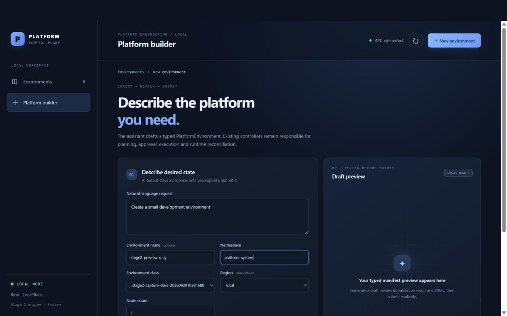

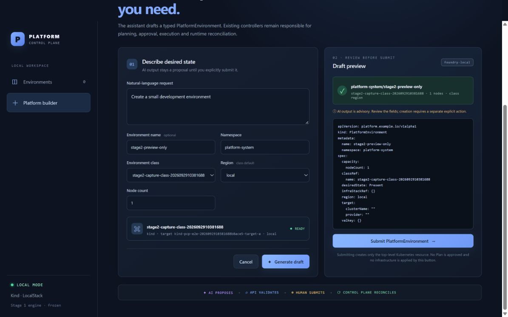

### TC-02｜创建计划、审批与就绪：通过

提交后，架构预览显示新增 1 个存储资源。审批前，Apply 记录数为 0，LocalStack 中也没有该资源。页面批准计划后，ChangeApproval 和 ApplyRun 均指向同一个 Plan UID 与摘要。最终环境的基础设施、运行时显示 `Ready`，资源清单为 1；目标 Service 和存储资源实际存在。

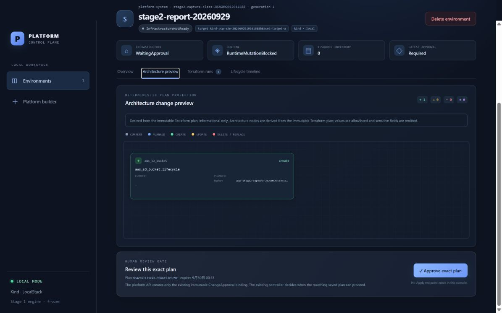

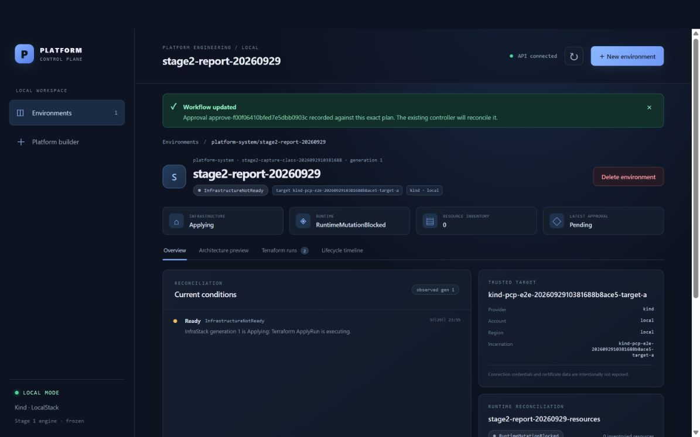

### TC-03｜容量更新：通过

在页面把节点数从 1 改为 2 后，环境进入第 2 代。新 Plan 的结果是 `NoChange`，页面重新显示 `Ready`。目标 Service 的 UID 未变化，原存储资源仍在，符合当前容量字段的基础设施语义。

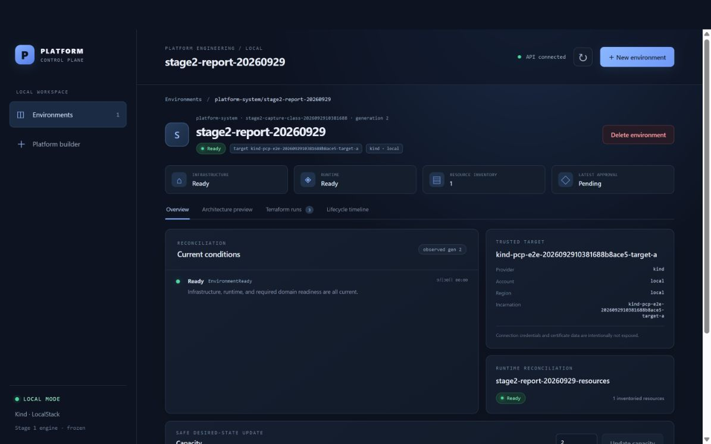

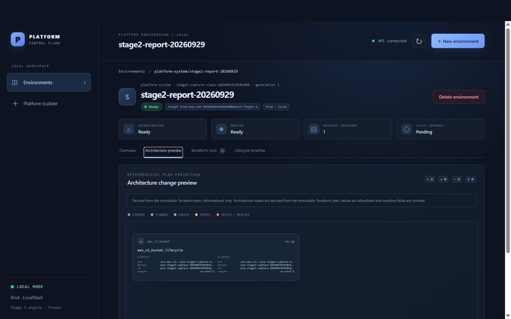

### TC-04｜删除、销毁审批与清理：通过

页面要求输入完整环境名称后才启用删除请求。提交请求后，环境进入 `Deleting`，运行时资源清单归零。独立销毁计划显示删除 1 个存储资源；批准前，对应 Apply 数量为 0，存储资源仍存在。通过页面单独批准后，审批和 ApplyRun 均与该销毁 Plan 的 UID、摘要一致。Terraform 执行终态为 `Succeeded`、退出码 0。最后环境对象、目标 Service 和存储资源均不存在，页面返回空环境总览。

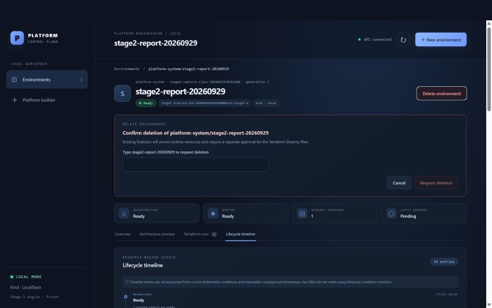

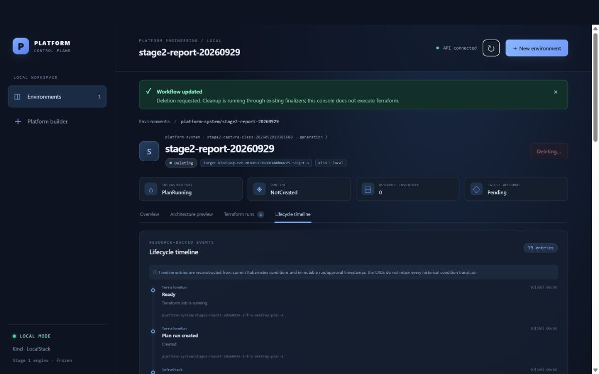

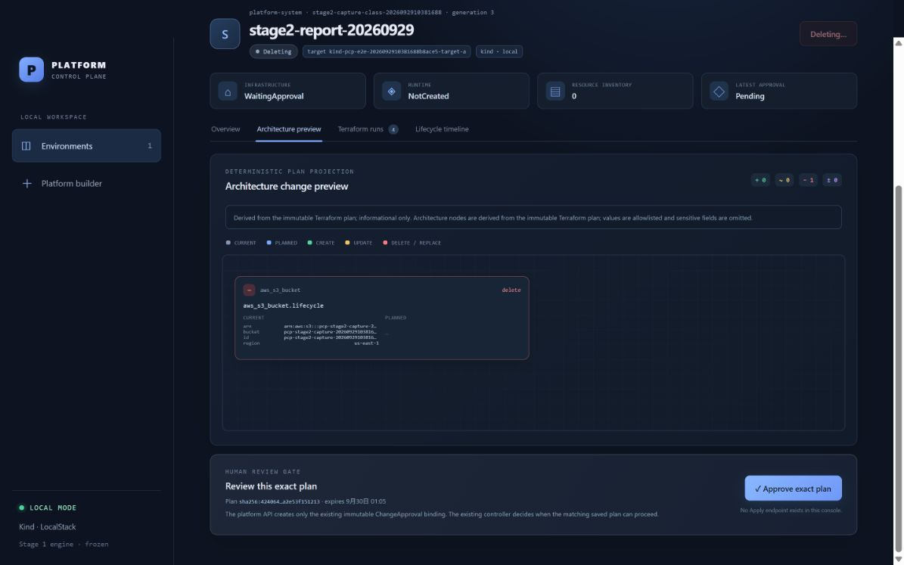

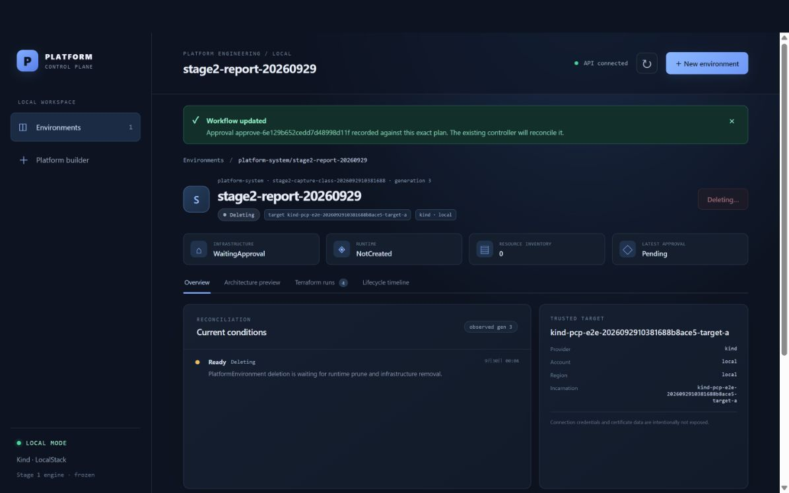

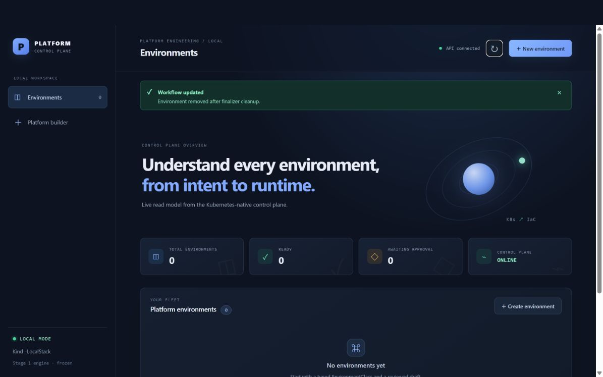

[查看销毁执行的原始终态记录](验收证据/销毁执行终态.json)。

### TC-05｜执行记录与时间线：通过

页面列出创建 Plan、创建 Apply 与容量更新 Plan；生命周期时间线展示资源状态和运行记录。时间线由当前 Kubernetes 条件与不可变运行时间戳重建，因此不能把它当作每一次历史状态变化的完整审计日志。

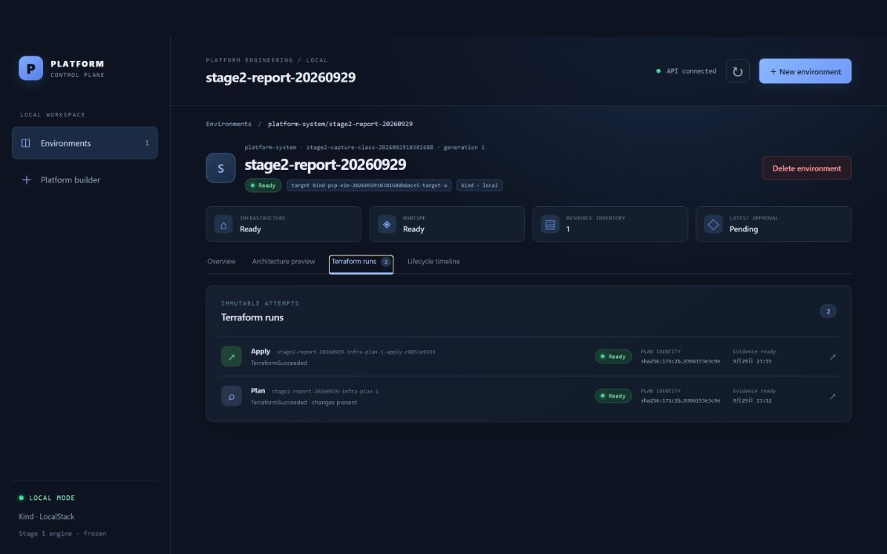

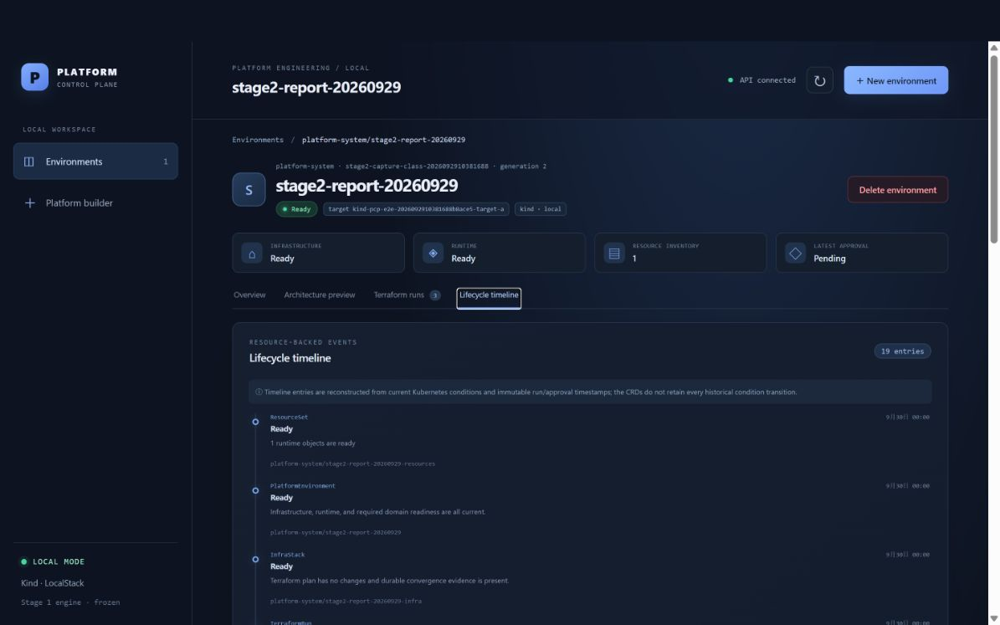

### TC-06｜第一阶段完整回归：通过

此前同版本的第一阶段完整回归结果为 `STAGE1_E2E=PASS`，退出码 0。本轮复核了其原始摘要；没有重新运行该套回归。它覆盖完整生命周期、控制器重启恢复、运行时更新、容量无变化、双目标隔离、失败封闭、销毁和清理。[查看原始回归摘要](验收证据/第一阶段回归摘要.txt)。

## 四、验收结论与范围

**结论：第二阶段本地端到端验收通过（`PASS_LOCAL`）。** TC-01 至 TC-06 均达到本报告列出的通过标准。创建和销毁均由用户在页面审批保存的计划，现有控制器负责执行；资源的创建与删除得到 Kubernetes、LocalStack 和 Terraform 终态交叉确认。

页面“最新审批”卡片在创建 Apply 成功后仍显示 `Pending`。因此本报告以审批对象、计划身份和执行终态判断审批是否生效；该卡片的状态用语需要进一步澄清。

**未验证：** 真实 AWS、生产部署及第三阶段能力。本地结果不能替代这些环境的验收。
